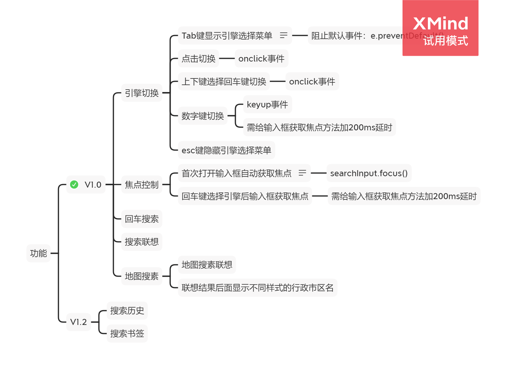

# 如何使用Vue.js开发Chrome插件？
本文以我的项目为例介绍了使用Vue.js代替原生JS开发Chrome扩展，及一些注意事项。项目地址：https://github.com/Lichun0529/QuickSearch-chrome
### 如何开发Chrome扩展
与Web开发类似，Chrome扩展也是由HTML+JS+CSS构成，点击拓展图标弹出的拓展功能页面是一个popup.html文件，在文件内可以引入CSS和JS，只需添加一个manifest配置文件就可以使扩展运行起来，参考《Chrome扩展及应用开发（首发版）》。
### 为什么使用Vue？
popup.html文件内可以在`<style>`编写CSS代码，但是不支持在`<script>`标签中编写JS代码，JS代码必须由外部引入。因此使用Vue.js可以实现在一个文件内同时写HTML+JS+CSS，同时解决了频繁操作DOM的问题，提升了开发效率。
### 一些注意事项
1. 想使用Vue需要先配置CSP，详见<a target="_blank" href="https://www.cnblogs.com/smartXiang/p/6929617.html" >https://www.cnblogs.com/smartXiang/p/6929617.html</a>
2. 为防止XSS攻击JSONP被浏览器CSP限制，如需跨域需要配置manifest.json文件，<a target="_blank" href="https://www.ituring.com.cn/book/miniarticle/60221" >详见《Chrome扩展及应用开发（首发版）》中关于跨域的章节。</a>
3. 作为web应用在本地调试和作为浏览器扩展在Chrome运行时请求接口方法、返回值格式不同。
### 功能设想


### 项目框架搭建
详见<a href="./CreateVueProjectFromZero" style="font-size:14px;" target="_blank">《如何不借助脚手架从零搭建Vue项目》</a>这篇文章或者使用vue-cli搭建vue项目框架。搭建完毕后打包项目，默认打包完目录为dist。

### 性能优化建议
+ 使用webpack打包、压缩代码。
+ 尽量不在`<head>`中使用`<link>`和`<script>`引入文件以减少加载页面时发送的请求数。

### 创建配置文件manifest.json
在项目打包后的根目录下创建manifest.json文件
```json
{
    "manifest_version": 2,  //必填，且必须为2
    "name": "我的第一个Chrome扩展",//扩展名
    "version": "1.0",
    "description": "我的第一个Chrome扩展",//扩展描述
    "icons": {//不同尺寸图标
        "16": "images/icon16.png",
        "48": "images/icon48.png",
        "128": "images/icon128.png"
    },
    "browser_action": {
        "default_icon": {
            "19": "images/icon19.png",
            "38": "images/icon38.png"
        },
        "default_title": "我的第一个Chrome扩展",//默认标题
        "default_popup": "index.html"//扩展主界面文件名
    },
    "content_security_policy": "script-src 'self' 'unsafe-eval'; object-src 'self'" //使用vue开发必须添加此配置
}
```
### 使用扩展
1. 打开Chrome设置界面
2. 点击左侧下方扩展程序
3. 打开右上角“开发者模式”开关
4. 点击左上角“加载已解压的扩展程序”
5. 选择dist目录
6. 点击地址栏右侧新增的扩展图标
### 踩坑记录
	- 1. vue runtime-only错误

	  vue.runtime.esm.js:620 [Vue warn]: You are using the runtime-only build of Vue where the template compiler is not available. Either pre-compile the templates into render functions, or use the compiler-included build.
	  
	  (found in <Root>)

		- 原因

			- 查找规则不同，网页中使用scrip标签导入的vue指向的是dist/vue.js，而使用import引入的vue指向的是dist/vue.runtime.common.js（严格版）

		- 解决方法

			- 方法一：不使用自动查找，直接指定路径：../node_modules/vue/dist/vue
			- 方法二：webpack配置文件中resolve节点下修改查找规则

		- 引申：import包查找规则（vue为例）

			- 1.查找根目录中有没有node_modules文件夹
			- 2.根据包名在node_modules中找到vue文件夹
			- 3.找到vue中packa.json文件
			- 4.在package.json中找到main节点对应的路径，路径指向的文件就是入口文件

	- 2. 无法引入.vue文件

		- 原因

			- webpack默认只能打包.js文件

		- 解决方法

			- 安装vue-loader和vue-template-compiler

		- 引申：loader调用过程

			- 1. 先拿到引入文件后缀名
			- 2. 在webpack.config.js中module节点下查找匹配规则，如果能找到则调用匹配规则进行处理，找不到则报错,多个loader时，由后向前调用
			- 3. 所有loader调用完毕将结果交给webpack打包合并，最终输出到出口js中

	- 3. 中无法引入.css文件

		- 原因

			- 同上

		- 解决方法

			- 安装css-loader和style-loader

	- 4. 打包完dist目录下index.html文件报错

	  Failed to load resource: net::ERR_FILE_NOT_FOUND

		- 原因

			- 未知

		- 解决方法

			- 删除webpack配置out节点下的publicPath

	- 5. 拓展添加到浏览器后报错 ：Uncaught EvalError

	  Uncaught EvalError: Refused to evaluate a string as JavaScript because 'unsafe-eval' is not an allowed source of script in the following Content Security Policy directive: "script-src 'self' blob: filesystem:".

		- 配置CSP

	- 6. 引入Bootstrap时Error: Can't resolve 'popper.js'

		- 手动安装popper.js

	- 7.  npm i bootstrap默认安装最新版bootstrap

### 参考资料
+ [webpack](https://www.webpackjs.com/)
+ [Chrome扩展及应用开发（首发版）](https://www.ituring.com.cn/book/1421)
+ [Chrome扩展非官方中文版文档](https://crxdoc-zh.appspot.com/extensions/getstarted)
+ [Chrome扩展官方文档](https://developer.chrome.com/extensions)
+ [Vue.js官方文档](https://cn.vuejs.org/index.html)
+ [使用Vue.js开发的扩展案例](https://github.com/lavyun/Easy-todo)