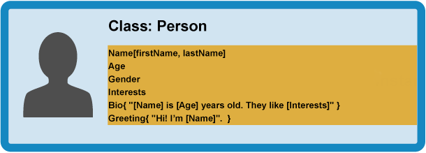
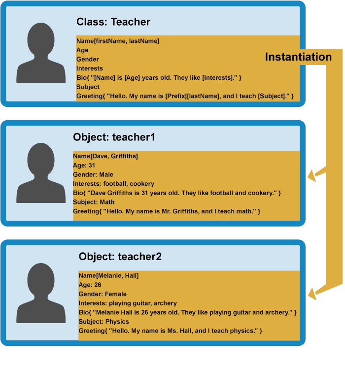

## 关于JavaScript中的面向对象思想

### 1.广义上的面向对象编程思想（OOP）

#### 1.理念

OOP的基础理念非常直观：**对象**是一个逻辑相关的数据和功能的合集，这个合集代表现实世界的一些数据或功能，并提供一个简单的方式来访问它的功能。

对象数据(也经常称为**函数**) 可以有结构的存储 (官方术语为 **封装**) 在对象包内 (也可以给一个特殊的名字来表示,有时候也叫做命名空间), 可以使它容易组织和访问。

以一个**人**（Person）举例，人有数据（名字、年龄、性别等）和功能（交流、工作等）。OPP使得编程人员能够以抽象（人）和具体（某个人）两种思维去思考事务。

##### 相关的基本词汇：

**类**（Class）指通用的东西（人），**实例**（或对象实例）指具体的东西（一个人，比如“张三”），功能 （工作）称作**方法**，

#### 2. 定义一个对象模板

OPP提供了一个层次分明的类继承框架（模板）。比如人类(class)可以被一个更加通用的类动物类(class)包含，每种动物都可能拥有雌性或雄性两种属性，但同在动物类下的人则拥有**使用工具**功能，而狗没有。所以可以说动物类(class)是人类(class)和狗类(class)的父类，人和狗是动物的子类。子类下可能还会有子类，例如狗可以按品种分类。

**以人为例定义一个Person类：**



#### 3. Person是抽象的，下面将基于Person创建出实例化对象person1和person2：


当一个对象需要从类中创建出来时，类的**构造函数**就会运行来创建这个实例。这种创建对象的过程我们称之为实例化-**实例对象**被类**实例化**。

#### 4. 创建基于其他类的子类

在OPP里可以基于父类创建出吉基于它的子类，子类们可以继承父类的数据和功能，如果子类之间功能不同还可以根据需要自定义特有的功能。


上面的Teacher子类比Student子类多了一个Subject属性，Greeting方法也不相同，但是都继承了Person类的Name,Age等属性。

#### 5. 根据子类创建对象



### 2. Javascript中的面向对象编程

#### 1. 使用普通函数定义一个人

```javascript
function createNewPerson(name) {
  var obj = {};
  obj.name = name;
  obj.greeting = function () {
    alert('Hi! I\'m ' + this.name + '.');
  }
  return obj;
}
```

```javascript
var salva = createNewPerson('salva');
salva.name;
salva.greeting();
```

#### 2. 使用构建函数定义一个人

```js
function Person(first, last, age, gender, interests) {
  this.name = {
    'first': first,
    'last': last
  };
  this.age = age;
  this.gender = gender;
  this.interests = interests;
  this.bio = function() {
    alert(this.name.first + ' ' + this.name.last + ' is ' + this.age + ' years old. He likes ' + this.interests[0] + ' and ' + this.interests[1] + '.');
  };
  this.greeting = function() {
    alert('Hi! I\'m ' + this.name.first + '.');
  };
};
```

这里使用了`this`关键词，即无论是该对象的哪个实例被这个构建函数创建，它的 `name` 属性就是传递到构建函数形参`name`的值，它的 `greeting()` 方法中也将使用相同的传递到构建函数形参`name`的值。

一个构建函数通常是**大写字母开头**，这样便于区分构建函数和普通函数。

```js
var person1 = new Person('Bob', 'Smith', 32, 'male', ['music', 'skiing']);
```

关键字 `new` 跟着一个含参函数，用于告知浏览器我们想要创建一个对象

### 3. 创建对象的其他方式

#### 1. 使用Object()构造函数

```js
var person1 = new Object();
```

然后可以根据需要使用点或括号表示法向此对象添加属性和方法

```js
person1.name = 'Chris';
person1['age'] = 38;
person1.greeting = function() {
  alert('Hi! I\'m ' + this.name + '.');
}
```

或者将对象文本传递给Object() 构造函数作为参数

```js
var person1 = new Object({
  name : 'Chris', 	
  age : 38,
  greeting : function() {
    alert('Hi! I\'m ' + this.name + '.');
  }
});
```

#### 2. 使用create()方法

```js
var person2 = Object.create(person1);
```

`person2`是基于`person1`创建的， 它们具有相同的属性和方法。

#### 5. ES6方法

```js
class Car {
    constructor(make,model){
      this.make = make;
      this.model = model;
      this.userGears= ['P','N','R','D'];
      this.userGear = this.userGears[0];
    }
    shift(gear){
      if(this.userGears.indexOf(gear)<0){
        throw new Error(`error: ${gear}`);
      }else{
        this.userGear = gear;
      }
    }
  }
```

```js
const car1 = new Car("Benz","S600");
  car1.shift('D');
```

ES6中的class也是function，与ES5实际上没有区别，只是增加了些语法糖

<Vssue style="margin-top:100px"/>