# CSS

## 一、层叠与继承

### 1. 层叠

#### 1. 资源顺序

权重相同时后面规则覆盖前面规则

#### 2. 优先级

##### 1. 选择器的优先级计算

一个选择器的优先级可以说是由四个部分相加 (分量)，可以认为是个十百千 — 四位数的四个位数：

1. **千位**： 如果声明在 `style` 的属性（内联样式）则该位得一分。这样的声明没有选择器，所以它得分总是1000。

2. **百位**： 选择器中包含ID选择器则该位得一分。

3. **十位**： 选择器中包含类选择器、属性选择器或者伪类则该位得一分。

4. **个位**：选择器中包含元素、伪元素选择器则该位得一分。

   > **注**: 通用选择器 (`*`)，组合符 (`+`, `>`, `~`, ' ')，和否定伪类 (`:not`) 不会影响优先级。
   >
   > **警告:** 在进行计算时不允许进行进位，例如，20 个类选择器仅仅意味着 20 个十位，而不能视为 两个百位，也就是说，无论多少个类选择器的权重叠加，都不会超过一个 ID 选择器。

| 选择器                                    | 千位 | 百位 | 十位 | 个位 | 优先级 |
| :---------------------------------------- | :--- | :--- | :--- | :--- | :----- |
| `h1`                                      | 0    | 0    | 0    | 1    | 0001   |
| `h1 + p::first-letter`                    | 0    | 0    | 0    | 3    | 0003   |
| `li > a[href*="en-US"] > .inline-warning` | 0    | 0    | 2    | 2    | 0022   |
| `#identifier`                             | 0    | 1    | 0    | 0    | 0100   |
| 内联样式                                  | 1    | 0    | 0    | 0    | 1000   |

#### 2. !important

`!important` 属性可以用来覆盖所有上面所有优先级计算，覆盖 `!important` 唯一的办法就是另一个 `!important` 具有 相同*优先级* 而且顺序靠后，或者更高优先级。

> **注：**非特殊情况尽量不使用

### 2. 继承

+ [`inherit`](https://developer.mozilla.org/zh-CN/docs/Web/CSS/inherit)：设置该属性会使子元素属性和父元素相同。实际上，就是 "开启继承".

+ [`initial`](https://developer.mozilla.org/zh-CN/docs/Web/CSS/initial)：设置属性值和浏览器默认样式相同。如果浏览器默认样式中未设置且该属性是自然继承的，那么会设置为 `inherit` 。

+ [`unset`](https://developer.mozilla.org/zh-CN/docs/Web/CSS/unset)：将属性重置为自然值，也就是如果属性是自然继承那么就是 `inherit`，否则和 `initial`一样

## 二、选择器

### 1.  元素选择器

```css
h1 { } 
```

### 2.  全局选择器

全局选择器，是由一个星号（`*`）代指的，它选中了文档中的所有内容（或者是父元素中的所有内容，比如，它紧随在其他元素以及邻代运算符之后的时候）。

```css
* {
    margin: 0;
}
article :first-child {

}
```

### 3. 类选择器

```css
.highlight {
    background-color: yellow;
}
h1.highlight {
    background-color: pink;
}
.notebox.danger {
    border: 4px solid red;
    font-weight: bold;
}
```

### 4. ID选择器

```css
#one {
    background-color: yellow;
}

h1#heading {
    color: rebeccapurple;
}
```

### 5. 属性选择器

#### 1. 属性和属性值

| 选择器              | 示例                            | 描述                                                         |
| :------------------ | :------------------------------ | :----------------------------------------------------------- |
| `[*attr*]`          | `a[title]`                      | 匹配带有一个名为*attr*的属性的元素——方括号里的值。           |
| `[*attr*=*value*]`  | `a[href="https://example.com"]` | 匹配带有一个名为*attr*的属性的元素，其值正为*value*——引号中的字符串。 |
| `[*attr*~=*value*]` | `p[class~="special"]`           | 匹配带有一个名为*attr*的属性的元素 ，其值正为*value*，或者匹配带有一个*attr*属性的元素，其值有一个或者更多，至少有一个和*value*匹配。注意，在一列中的好几个值，是用空格隔开的。 |
| `[*attr*|=*value*]` | `div[lang|="zh"]`               | 匹配带有一个名为*attr*的属性的元素，其值可正为*value*，或者开始为*value*，后面紧随着一个连字符。 |

#### 2. 子字符串匹配选择器

| 选择器              | 示例                | 描述                                                         |
| :------------------ | :------------------ | :----------------------------------------------------------- |
| `[*attr*^=*value*]` | `li[class^="box-"]` | 匹配带有一个名为*attr*的属性的元素，其值开头为*value*子字符串。 |
| `[*attr*$=*value*]` | `li[class$="-box"]` | 匹配带有一个名为*attr*的属性的元素，其值结尾为*value*子字符串 |
| `[*attr**=*value*]` | `li[class*="box"]`  | 匹配带有一个名为*attr*的属性的元素，其值的字符串中的任何地方，至少出现了一次*value*子字符串。 |

#### 3. 关闭大小写敏感

使用`i`值

```
li[class^="a" i] {
    color: red;
}
```

### 6. 伪类和伪元素

#### 1. 伪类

##### 1. 状态相关

- `:link`
- `:visited`
- `:hover`
- `:active`
- `:focus`

##### 2. 结构相关

父子元素间的元素位置

+ `:first-child`：父元素下的第一个子元素

  ```
  p:first-child{} //选择父元素下的第一个p标签
  ```

+ `:last-child`

+ `:nth-child` 根据元素的位置匹配一个或者多个元素，它接受一个an+b形式的参数 如:nth-child(2n)

+ `:nth-last-child` 与:nth-child类似，但是从最后一个子元素开始计数

+ `:only-child`

父子元素间的元素类型

- `:first-of-type` 匹配当前元素是其父元素的第一个该类型元素的元素
- `:last-of-type`
- `:nth-of-type`
- `:nth-last-of-type`
- `:only-of-type`

其他

- `:not` 匹配不符合参数选择器的元素
- `:target` 匹配URL中的锚指向的元素
- `:empty` 匹配没有子元素的元素

表单通用

- `:disabled` 禁用的
- `:enabled` 可用的
- `:required` 必选的
- `:optional` 可选的
- `:read-only` 只能读
- `:read-write` 能读能写
- `:default` 默认样式，对button input option 有用，目测平时用不着
- `:valid` 合法的
- `:invalid` 非法的
- `:focus` // 通用伪类，对于表单元素来说更常见

文本类

- `:placeholder-shown` // 草稿中 可以指定显示placeholder的时候input元素的样式，注意这不能修改placeholder的样式，如果想要修改，请使用`::placeholder`

选择类

- `:checked` 包括`input[type="checkbox"]:checked`, `input[type="radio"]:checked`, `option:checked`(实际上并没有什么卵用，因为option的样式并不能通过CSS来修改)
- `:indeterminate` 未定

数字类

- `:in-range` `:input[type="number"]:in-range` 在指定区间内
- `:out-of-range` `:input[type="number"]:out-of-range` 不在指定区间

#### 2. 伪元素

- `::after`
- `::before`
- `::first-letter`
- `::first-line`

- `::selection` 文档中被用户高亮的部分，只支持color, background-color, cursor, outline, text-decoration, text-emphasis-color和text-shadow
- `::placeholder` input元素中placeholder文本的样式

### 7. 关系选择器

#### 1. 后代

空格连接，选子代及更下级后代

```
.box p {
    color: red;
}  
```

#### 2. 子代

只选子代，不选更下级后代i

```
ul > li {
    border-top: 5px solid red;
}  
```

#### 3. 相邻兄弟

只选择相邻的平级元素

```
h1 + p {
    background-color: #333;
}
```

#### 4. 通用兄弟

选择相邻的所有平级元素

```
h1 ~ p {
    background-color: #333;
}
```

## 三、盒模型

CSS盒模型本质上是一个盒子，封装了周围的HTML元素，它包括：`外边距margin`，`边框border`，`内边距padding`，和`内容content`。

### 1. 块级盒子（Block box） 和 内联盒子（Inline box）

**块级盒子（Block box）：**

- 不规定宽度时绝大数情况下盒子会和父容器一样宽
- 每个盒子都会换行
- [`width`](https://developer.mozilla.org/zh-CN/docs/Web/CSS/width) 和 [`height`](https://developer.mozilla.org/zh-CN/docs/Web/CSS/height) 属性可以发挥作用
- 内边距（padding）, 外边距（margin） 和 边框（border） 会将其他元素从当前盒子周围“推开”

**内联盒子（Inline box）：**

- 盒子不会产生换行
-  [`width`](https://developer.mozilla.org/zh-CN/docs/Web/CSS/width) 和 [`height`](https://developer.mozilla.org/zh-CN/docs/Web/CSS/height) 属性将不起作用
- 内边距、外边距以及边框会被应用但是不会把其他处于 `inline` 状态的盒子从垂直方向推开

### 2. 块级格式化上下文(Block Formatting Context，BFC)

BFC 是一块**独立**的渲染区域，只有它内部的块级盒子参与它的布局。这些块级盒子的布局方式不会受BFC外部布局的影响，同时它们也不会影响BFC外部的布局。

#### 1. 如何触发BFC

+ float不为none

+ position不为relative或static
+ overflow为auto，scroll或hiden
+ display为table-cell或inline-block

#### 2. 通过触发BFC解决的问题：

##### 1. 浮动元素的父元素高度坍塌

假设页面中有一个父元素和几个子元素，当子元素都设定为浮动时会产生父元素高度坍塌现象，这是因为子元素脱离了文档流形成新的队列，下方其他元素无法触及他们，父元素也检测不到他们的存在，所以高度无法被撑起。

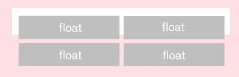

**解决方法：**

1. 给父元素添加属性 overflow：hidden

2. 给父元素添加属性 display：table-cell或inline-block

3. 给父元素添加属性 position：fixed或absolute

   以上情况都不可用时：

4. 让父元素也变成浮动元素，缺点：影响下面其他元素排列

   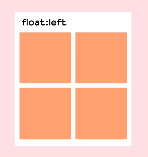

5. 给父元素固定高度，缺点：只适用于已知子元素高度的情况

   

6. 在子元素最后添加一个空元素，然后添加clear：both清除浮动，缺点：添加无意义标签，不利于维护

   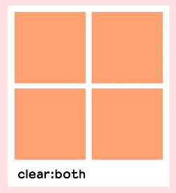

7. 为浮动的最后一个子元素设置伪元素::after:{clear:both}，缺点：复用不当会导致代码量增加

   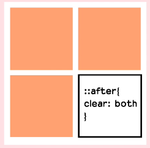

##### 2. 两栏自适应布局

一般左侧栏定宽右侧栏浮动变化的两栏自适应布局是通过float实现的，利用了块级元素会占满一行的特性，右侧会随窗口宽度改变而改变，左侧则永远浮动在上方。

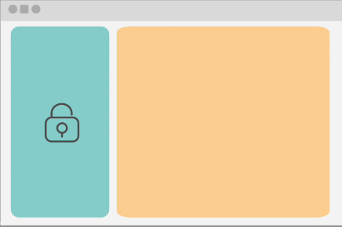

但当右侧内容过多时会内容会流动到左侧，形成类似环绕的效果

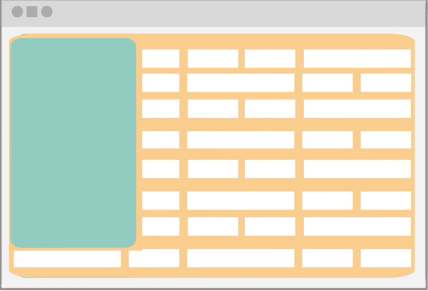

**解决方法：**为右侧元素触发BFC

**其他两栏布局方法：**

1.左侧浮动，右侧设置margin

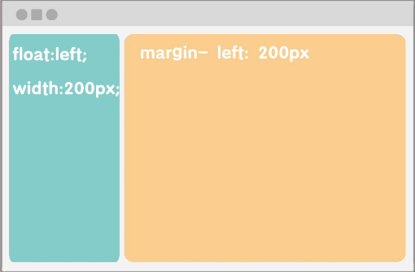

2.左侧绝对定位，右侧设置margin

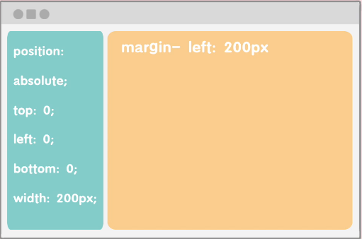

3.右侧元素设置顶线右线为0，左线为左侧元素宽度，宽度设为100%

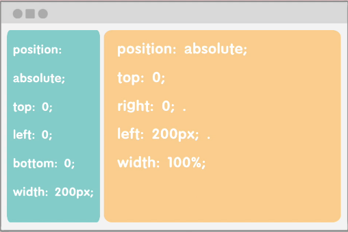

##### 3. 外边距垂直方向重合

当块级元素（block）的[上外边距(margin-top)](https://developer.mozilla.org/zh-CN/docs/Web/CSS/margin-top)和[下外边距(margin-bottom)](https://developer.mozilla.org/zh-CN/docs/Web/CSS/margin-bottom)同时都有设定时只会只会保留最大边距。

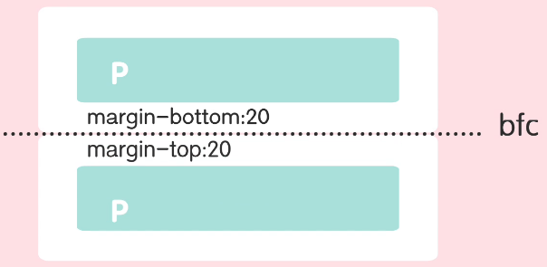

**解决方法：**

1.为其中一个元素包裹父元素，并为父元素触发BFC

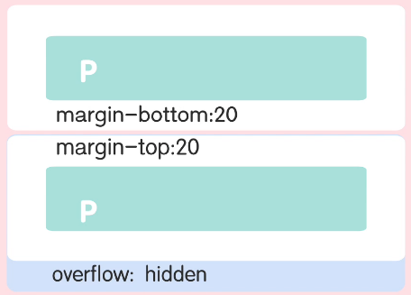

2.用padding代替margin，缺点：padding无法再做其他用途

### 3. 盒模型概念

**标准盒模型**和**替代（IE）盒模型**的区别在于标准盒模型的`width`和`height`只计算`content`，IE盒模型则计算`border`以内。


设置box-sizing属性值可以改变盒模型

```css
html {//全局改变盒模型
  box-sizing: border-box; //IE盒子模型
}
*, *::before, *::after {
  box-sizing: inherit;
}
```

### 4. 外边距，内边距，边框

#### 1. padding和margin属性值顺序

+ 4个属性值时：上，右，下，左
+ 3个属性值时：上，左右，下
+ 2个属性值时：上下，左右
+ 1个属性值时：上下左右

#### 2. 外边距折叠

当块级元素（block）的[上外边距(margin-top)](https://developer.mozilla.org/zh-CN/docs/Web/CSS/margin-top)和[下外边距(margin-bottom)](https://developer.mozilla.org/zh-CN/docs/Web/CSS/margin-bottom)同时都有设定时只会只会保留最大边距。

> 注：设定[float](https://developer.mozilla.org/zh-CN/docs/Web/CSS/float)和[position=absolute](https://developer.mozilla.org/zh-CN/docs/Web/CSS/position#absolute)的元素不会产生外边距重叠行为。

#### 3. 边框

使用[`border`](https://developer.mozilla.org/zh-CN/docs/Web/CSS/border)属性一次设置所有四个边框的宽度、颜色和样式。

分别设置每边的宽度、颜色和样式，可以使用：

- [`border-top`](https://developer.mozilla.org/zh-CN/docs/Web/CSS/border-top)
- [`border-right`](https://developer.mozilla.org/zh-CN/docs/Web/CSS/border-right)
- [`border-bottom`](https://developer.mozilla.org/zh-CN/docs/Web/CSS/border-bottom)
- [`border-left`](https://developer.mozilla.org/zh-CN/docs/Web/CSS/border-left)

设置所有边的颜色、样式或宽度，请使用以下属性：

- [`border-width`](https://developer.mozilla.org/zh-CN/docs/Web/CSS/border-width)
- [`border-style`](https://developer.mozilla.org/zh-CN/docs/Web/CSS/border-style)
- [`border-color`](https://developer.mozilla.org/zh-CN/docs/Web/CSS/border-color)

设置单边的颜色、样式或宽度，可以使用最细粒度的普通属性之一：

- [`border-top-width`](https://developer.mozilla.org/zh-CN/docs/Web/CSS/border-top-width)
- [`border-top-style`](https://developer.mozilla.org/zh-CN/docs/Web/CSS/border-top-style)
- [`border-top-color`](https://developer.mozilla.org/zh-CN/docs/Web/CSS/border-top-color)
- [`border-right-width`](https://developer.mozilla.org/zh-CN/docs/Web/CSS/border-right-width)
- [`border-right-style`](https://developer.mozilla.org/zh-CN/docs/Web/CSS/border-right-style)
- [`border-right-color`](https://developer.mozilla.org/zh-CN/docs/Web/CSS/border-right-color)
- ...

### 5. display: inline-block

一个元素使用 `display: inline-block`，实现我们需要的块级的部分效果：

- 设置`width` 和`height` 属性会生效。
- `padding`, `margin`, 以及`border` 会推开其他元素。

### 6. 文档流

浏览器按从上到下从左到右的顺序读取DOM树的文档节点，然后将这些节点顺序存放到文档流中。

## 四、背景

#### 1. 利用background-position实现精灵图

```
.box {
  background-image: url(star.png);
  background-repeat: no-repeat;
  background-position: 1em 1em;
}
```

#### 2. background-size

```
.box {
  background-image: url(balloons.jpg);
  background-repeat: no-repeat;
  background-size:contain; 
}
```

属性值：

+ contain：保持宽高比，图片不会超出盒子（可能出现间隙）
+ cover：保持宽高比，图片完全覆盖盒子（可能超出盒子）

## 函数

## @规则