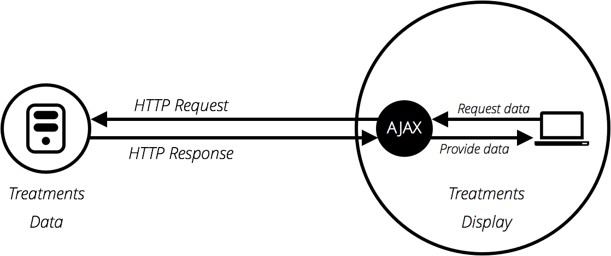
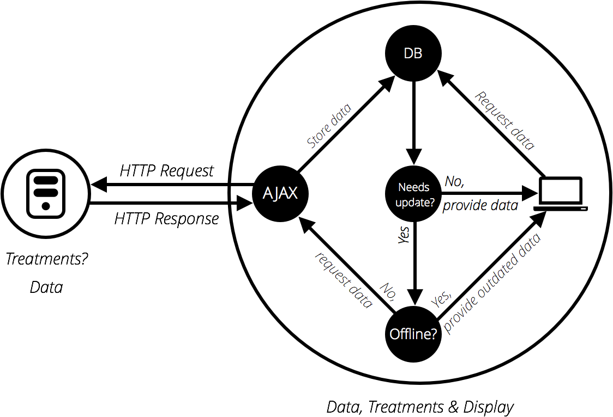

# JavaScript

## 一、语法

### 1. 语法基础

#### 1. 变量命名规则

+ 区分大小写

+ 不可有空格或除“$”和“_”的标点符号
+ 首字母不可为数字
+ 避免使用[保留字](https://developer.mozilla.org/en-US/docs/Web/JavaScript/Reference/Lexical_grammar#Keywords)
+ 一个可靠的命名约定叫做 ["小写驼峰命名法"](https://en.wikipedia.org/wiki/CamelCase#Variations_and_synonyms)，用来将多个单词组在一起，小写整个命名的第一个字母然后大写剩下单词的首字符

#### 2. 数据类型

+ 字符串
+ 数字
+ 布尔

#### 3. 数组

数组是指用一个变量表示一个值的集合。

声明：

```javascript
var beatles = ["3","4"]
```

访问：

```javascript
console.log(beatles[0]);// 3
```

+ 集合中每个值都是这个数组的一个**元素**
+ 元素在数组中的位置就是这个元素的**下标（index）**
+ 使用 “[ ]” 获取元素
+ 下标必须用方括号括起来，第一个下标为**0**
+ 数组元素可以是任何数据类型、变量或另一个数组

**关联数组：**数组的下标可以是字符串

```javascript
var beatles = [];
beatles["name"] = "John";
beatles["member"] = "4";
```

此时相当于给数组添加了`name`和`member`属性，一般**不推荐**修改数组属性，此时应该使用**对象**

#### 4. 对象

与数组类似，也是用一个变量表示一组值，对象里每个值是这个对象的一个**属性**

声明：

```javascript
var lennon = {name:'John',living:false}
```

访问：

```javascript
console.log(lennon.name);// John
```

+ 命名规则与变量类似

+ 使用 “.” 获取属性

+ 属性值可以是任意类型

使用对象而不是传统数组声明数据意味着可以使用值的名字来引用而不是下标数字，提高了代码可读性。

### 2. 运算符

#### 1. 算术运算符

| 运算符 | 名称                 | 作用                                                         | 示例                                                         |
| :----- | :------------------- | :----------------------------------------------------------- | :----------------------------------------------------------- |
| `+`    | 加法                 | 两个数相加。                                                 | `6 + 9`                                                      |
| `-`    | 减法                 | 从左边减去右边的数。                                         | `20 - 15`                                                    |
| `*`    | 乘法                 | 两个数相乘。                                                 | `3 * 7`                                                      |
| `/`    | 除法                 | 用右边的数除左边的数                                         | `10 / 5`                                                     |
| `%`    | 求余(有时候也叫取模) | 在你将左边的数分成同右边数字相同的若干整数部分后，返回剩下的余数 | `8 % 3` (返回 2，8除以3的倍数，余下2 。)`59 % 60`（返回59，商是0，余59） |
| `**`   | 幂                   | 取底数的指数次方，即指数所指定的底数相乘。它在EcmaScript 2016 中首次引入。 | `5 ** 5` (返回 3125，相当于 `5 * 5 * 5 * 5 * 5` 。)          |

#### 2. 递增递减运算符

| 运算符    | 解释                                                       | 符号  | 示例                    |
| :-------- | :--------------------------------------------------------- | :---- | :---------------------- |
| 递增/递减 | ++在后第一次返回原值，++在前第一次返回递增后的值，递减同样 | ++/-- | `let num = 1; num++//1` |

#### 3. 赋值运算符

| 运算符 | 名称     | 作用                                           | 示例             | 等价于              |
| :----- | :------- | :--------------------------------------------- | :--------------- | :------------------ |
| `+=`   | 加法赋值 | 右边的数值加上左边的变量，然后再返回新的变量。 | `x = 3;x += 4;`  | `x = 3;x = x + 4;`  |
| `-=`   | 减法赋值 | 左边的变量减去右边的数值，然后再返回新的变量。 | `x = 6;x -= 3;`  | `x = 6;x = x - 3;`  |
| `*=`   | 乘法赋值 | 左边的变量乘以右边的数值，然后再返回新的变量。 | `x = 2;x *= 3;`  | `x = 2;x = x * 3;`  |
| `/=`   | 除法赋值 | 左边的变量除以右边的数值，然后再返回新的变量。 | `x = 10;x /= 5;` | `x = 10;x = x / 5;` |

### 3. 字符串

字符串可以进行的操作：

+ 转义： `\`
+ 连接： `+`
+ 获得字符串的长度 : [`length`](https://developer.mozilla.org/zh-CN/docs/Web/JavaScript/Reference/Global_Objects/String/length) 属性
+ 检索特定字符串字符:`someString[0];`
+ 在字符串中查找子字符串:[`indexOf()`](https://developer.mozilla.org/zh-CN/docs/Web/JavaScript/Reference/Global_Objects/String/indexOf)方法
+ 从字符串中提取片段：[`slice()方法`](https://developer.mozilla.org/zh-CN/docs/Web/JavaScript/Reference/Global_Objects/String/slice)
+ 转换大小写：[`toLowerCase()`](https://developer.mozilla.org/zh-CN/docs/Web/JavaScript/Reference/Global_Objects/String/toLowerCase)和[`toUpperCase()`](https://developer.mozilla.org/zh-CN/docs/Web/JavaScript/Reference/Global_Objects/String/toUpperCase)
+ 替换字符串的某部分： [`replace()`](https://developer.mozilla.org/zh-CN/docs/Web/JavaScript/Reference/Global_Objects/String/replace)方法

### 4. 数组

数组可以进行的操作：

+ 将字符串分割成数组：`split()`
+ 将数组使用分隔符转换成字符串：`join()`
+ 将数组直接转换成字符串：`toString()`
+ 在数组末尾添加一个项目：`push()`
+ 在数组末尾删除一个项目：`pop()`
+ 在数组开头添加一个项目：`unshift()()`
+ 在数组开头删除一个项目：`shift()`

### 5. 代码块

#### 1. 条件

任何不是 `false`, `undefined`, `null`, `0`, `NaN` 的值，或一个空字符串（''）在作为条件语句进行测试时实际返回true

#### 2. 循环

break退出循环

continue跳过迭代

1. **`for ... in`** 为遍历对象属性而构建，不建议与数组一起使用
2. **`for...of`**在[可迭代对象](https://developer.mozilla.org/zh-CN/docs/Web/JavaScript/Guide/iterable)（包括 [`Array`](https://developer.mozilla.org/zh-CN/docs/Web/JavaScript/Reference/Array)，[`Map`](https://developer.mozilla.org/zh-CN/docs/Web/JavaScript/Reference/Map)，[`Set`](https://developer.mozilla.org/zh-CN/docs/Web/JavaScript/Reference/Global_Objects/Set)，[`String`](https://developer.mozilla.org/zh-CN/docs/Web/JavaScript/Reference/String)，[`TypedArray`](https://developer.mozilla.org/zh-CN/docs/Web/JavaScript/Reference/Global_Objects/TypedArray)，[arguments](https://developer.mozilla.org/en-US/docs/Web/JavaScript/Reference/Functions_and_function_scope/arguments) 对象等等）上创建一个迭代循环，调用自定义迭代钩子，并为每个不同属性的值执行语句，可代替**for each**

#### 3. 函数

1.匿名函数

没有定义名称的方法

```js
function() {
  alert('hello');
}
```

通常作为响应事件被触发：

```js
myButton.onclick = function() {
  alert('hello');
}
```

2.作用域 scope

创建一个函数时，函数内定义的变量和其他东西都在它们自己的单独的范围内, 意味着它们被锁在自己独立的隔间中, 不能被函数外的代码访问。

所有函数的最外层被称为**全局作用域**。 在全局作用域内定义的值可以在任意地方访问。

#### 4. 事件

1.addEventListener() 添加事件监听

```js
btn.addEventListener('click', bgChange);
```

2.removeEventListener() 移除事件监听

```js
btn.removeEventListener('click', bgChange);
```

3.添加多个监听

```js
myElement.addEventListener('click', functionA);
myElement.addEventListener('click', functionB);
```

**注：**不应该在HTML标签属性上添加事件

4.事件对象 Event

[Event](https://developer.mozilla.org/zh-CN/docs/Web/API/Event)接口被自动传递给事件处理函数作为参数，以提供额外的功能和信息。

5.事件冒泡和捕捉

```html
<body onclick="bodyClick()">
    <div onclick="divClick()">
        <button onclick="btn()">
            <p onclick="p()">点击冒泡</p>
        </button>
    </div>
</body>
```

当一个事件发生在具有父元素的元素上时，浏览器运行两个不同的阶段 - 捕获阶段和冒泡阶段。 在冒泡阶段：

 `p()` => `btn()` => `divClick()` => `bodyClick()` 

在捕获阶段则相反，在现代浏览器中，默认情况下，所有事件处理程序都在**冒泡阶段**进行注册。

使用`stopPropagation()`阻止冒泡：

```js
p(e){
	e.stopPropagation();
}
```

## 二、对象

对象是一个包含相关数据和方法的集合（通常由一些变量和函数组成，我们称之为对象里面的属性和方法）。在 JavaScript 中，大多数事物都是对象, 从作为核心功能的字符串和数组，到建立在 JavaScript 之上的浏览器 [API](https://developer.mozilla.org/zh-CN/docs/Glossary/API) 。

```javascript
var person = {
            name : ['Bob', 'Smith'],
            age : 32,
            gender : 'male',
            interests : ['music', 'skiing'],
            bio : function() {
                alert(this.name[0] + ' ' + this.name[1] + ' is ' + this.age + ' years old. He likes ' + this.interests[0] + ' and ' + this.interests[1] + '.');
            },
            greeting: function() {
                alert('Hi! I\'m ' + this.name[0] + '.');
            }
        };
```

对象中可以存放数组、数字、字符串、方法等数据，前4个成员是资料项目，被称为对象的**属性(property)**，后两个成员是函数，允许对象对资料做一些操作，被称为对象的**方法(method)**

### 1. 语法

#### 1. 定义

```javascript
var objectName = {
  member1Name : member1Value,
  member2Name : member2Value,
  member3Name : member3Value
}
```

#### 2. 访问

```javascript
person.age
person.interests[1]
person.bio()
```

**命名空间**(namespace) + **点** + **要访问的项目标识**，可以是简单属性的名字(name)，或者是数组属性的一个子元素，又或者是对象的方法调用。

#### 3. 子命名空间

用一个对象来做另一个对象成员的值。例如将name成员

```js
name : ['Bob', 'Smith'],
```

改成

```js
name : {
  first : 'Bob',
  last : 'Smith'
},
```

访问：

```js
person.name.first
person.name.last
```

#### 4. 像数组一样使用中括号访问

```js
person['age']
person['name']['first']
```

使用了关联了值的名字，而不是索引去选择元素。对象做了字符串到值的映射，而数组做的是数字到值的映射。对象有时被称之为**关联数组(associative array)**。

#### 5. 设置对象成员的值

修改值：

```js
person.age = 45
person['name']['last'] = 'Cratchit'
```

创建新成员：

```js
person['eyes'] = 'hazel'
person.farewell = function() { alert("Bye everybody!") }
```

**括号表示法**一个有用的地方是它不仅可以动态的去设置对象成员的值，还可以动态的去设置成员的名字。将新成员的名字设置为变量：

```js
var myDataName = nameInput.value
var myDataValue = nameValue.value
person[myDataName] = myDataValue
```

这是使用**点表示法无法做到**的，点表示法只能接受**字面量**的成员的名字，不接受**变量**作为名字。

>**字面量**是指由字母，数字等构成的字符串或者数值，它只能作为右值出现(右值是指等号右边的值，如：int a=123这里的a为左值，123为右值。)，常量和变量都属于变量，只不过常量是赋过值后不能再改变的变量，而普通的变量可以再进行赋值操作。

#### 6. this的含义

关键字"this"指向了当前代码运行时的对象( 原文：the current object the code is being written inside )——这里即指person对象，它保证了当代码的上下文(context)改变时变量的值的正确性（比如：不同的person对象拥有不同的name这个属性，很明显greeting这个方法需要使用的是它们自己的name）。

```js
var person1 = {
  name : 'Chris',
  greeting: function() {
    alert('Hi! I\'m ' + this.name + '.');
  }
}

var person2 = {
  name : 'Brian',
  greeting: function() {
    alert('Hi! I\'m ' + this.name + '.');
  }
}
```

person1.greeting()会输出："Hi! I'm Chris."；person2.greeting()会输出："Hi! I'm Brain."，即使greeting这个方法的代码是一样的。this 指向了代码所在的对象(其实代码运行时所在的对象)。在字面量的对象里this看起来不是很有用，但是当你动态创建一个对象（例如使用构造器）时它是非常有用的。

#### 7. 实例化的简单例子

当在使用一个字符串方法时，例如：

```js
myString.split(',');
```

实际上就会有一个String实例被创建，split()方法是这个对象下的一个可用方法，这个对象下还有其他可用的属性和方法，例如slice()、myString.length等。

内建的对象或API不会总是自动地创建对象的实例，举例来说，这个 [Notifications API](https://developer.mozilla.org/en-US/docs/Web/API/Notifications_API)——允许浏览器发起系统通知，需要你为每一个你想发起的通知都使用构造器进行**实例化**

```js
var myNotification = new Notification('Hello!');
```


### 2. [JavaScript面向对象编程思想](https://developer.mozilla.org/zh-CN/docs/Learn/JavaScript/Objects/Object-oriented_JS)

#### 1.广义上的面向对象编程思想（OOP）

##### 1.理念

OOP的基础理念非常直观：**对象**是一个逻辑相关的数据和功能的合集，这个合集代表现实世界的一些数据或功能，并提供一个简单的方式来访问它的功能。

对象数据(也经常称为**函数**) 可以有结构的存储 (官方术语为 **封装**) 在对象包内 (也可以给一个特殊的名字来表示,有时候也叫做命名空间), 可以使它容易组织和访问。

以一个**人（Person）**举例，人有数据（名字、年龄、性别等）和功能（交流、工作等）。OPP使得编程人员能够以抽象（人）和具体（某个人）两种思维去思考事务。

**相关的基本词汇：**

**类（Class）**指通用的东西（人），**实例（或对象实例）**指具体的东西（一个人，比如“张三”），功能 （工作），称作**方法**，

##### 2. 定义一个对象模板

OPP提供了一个层次分明的类继承框架（模板）。比如人类(class)可以被一个更加通用的类动物类(class)包含，每种动物都可能拥有雌性或雄性两种属性，但同在动物类下的人则拥有**使用工具**功能，而狗没有。所以可以说动物类(class)是人类(class)和狗类(class)的父类，人和狗是动物的子类。子类下可能还会有子类，例如狗可以按品种分类。

**以人为例定义一个Person类：**


##### 3. Person是抽象的，下面将基于Person创建出实例化对象person1和person2：


当一个对象需要从类中创建出来时，类的**构造函数**就会运行来创建这个实例。这种创建对象的过程我们称之为实例化-**实例对象**被类**实例化**。

##### 4. 创建基于其他类的子类

在OPP里可以基于父类创建出吉基于它的子类，子类们可以继承父类的数据和功能，如果子类之间功能不同还可以根据需要自定义特有的功能。


上面的Teacher子类比Student子类多了一个Subject属性，Greeting方法也不相同，但是都继承了Person类的Name,Age等属性。

##### 5. 根据子类创建对象


#### 2. Javascript中的面向对象编程

##### 1. 使用普通函数定义一个人

```javascript
function createNewPerson(name) {
  var obj = {};
  obj.name = name;
  obj.greeting = function () {
    alert('Hi! I\'m ' + this.name + '.');
  }
  return obj;
}
```

```javascript
var salva = createNewPerson('salva');
salva.name;
salva.greeting();
```

##### 2. 使用构建函数定义一个人

```js
function Person(first, last, age, gender, interests) {
  this.name = {
    'first': first,
    'last': last
  };
  this.age = age;
  this.gender = gender;
  this.interests = interests;
  this.bio = function() {
    alert(this.name.first + ' ' + this.name.last + ' is ' + this.age + ' years old. He likes ' + this.interests[0] + ' and ' + this.interests[1] + '.');
  };
  this.greeting = function() {
    alert('Hi! I\'m ' + this.name.first + '.');
  };
};
```

这里使用了`this`关键词，即无论是该对象的哪个实例被这个构建函数创建，它的 `name` 属性就是传递到构建函数形参`name`的值，它的 `greeting()` 方法中也将使用相同的传递到构建函数形参`name`的值。

一个构建函数通常是**大写字母开头**，这样便于区分构建函数和普通函数。

```js
var person1 = new Person('Bob', 'Smith', 32, 'male', ['music', 'skiing']);
```

关键字 `new` 跟着一个含参函数，用于告知浏览器我们想要创建一个对象

#### 3. 创建对象的其他方式

##### 1. 使用Object()构造函数

```js
var person1 = new Object();
```

然后可以根据需要使用点或括号表示法向此对象添加属性和方法

```js
person1.name = 'Chris';
person1['age'] = 38;
person1.greeting = function() {
  alert('Hi! I\'m ' + this.name + '.');
}
```

或者将对象文本传递给Object() 构造函数作为参数

```js
var person1 = new Object({
  name : 'Chris', 	
  age : 38,
  greeting : function() {
    alert('Hi! I\'m ' + this.name + '.');
  }
});
```

##### 2. 使用create()方法

```js
var person2 = Object.create(person1);
```

`person2`是基于`person1`创建的， 它们具有相同的属性和方法。

##### 5. ES6方法

```js
class Car {
    constructor(make,model){
      this.make = make;
      this.model = model;
      this.userGears= ['P','N','R','D'];
      this.userGear = this.userGears[0];
    }
    shift(gear){
      if(this.userGears.indexOf(gear)<0){
        throw new Error(`error: ${gear}`);
      }else{
        this.userGear = gear;
      }
    }
  }
```

```js
const car1 = new Car("Benz","S600");
  car1.shift('D');
```

ES6中的class也是function，与ES5实际上没有区别，只是增加了些语法糖

### 3. 对象原型 prototype 

每个对象拥有一个叫做**原型（prototype）**的特殊属性 ，对象以其原型为模板、从原型继承方法和属性。

**原型链：**原型对象也可能拥有原型，并从中继承方法和属性，一层一层、以此类推。这种关系常被称为**原型链 (prototype chain)**，它解释了为何一个对象会拥有定义在其他对象中的属性和方法。

#### 1. 对象与对象之间的关系

```js
let a = { //对象a
            name:'a',//属性name
            show(){ //方法show
                console.log(this.name);
            }
        };
        let b = {name:'b'}; //对象b
        let c = {name:'c'}; //对象c
        Object.setPrototypeOf(b,a);//设置b是a的子类
        Object.setPrototypeOf(c,b);//设置c是b的子类
        console.log(c);
```

```js
c.__proto__ === b //对象c的原型为对象b中的属性和方法
c.__proto__.__proto__ === a //对象c的原型的原型为对象a中的属性和方法
c.__proto__.__proto__.__proto__ === Object.prototype //对象c的原型的原型的原型为构造函数Object的prototype属性(属性值为一个对象，原型链下游对象继承的属性和方法都暴露在其中)

b.proto === a //同上
b.__proto__.__proto__ ===  Object.prototype //同上

a.__proto__ === Object.prototype //同上

c.show() //‘c’ 对象c中没有show方法，但是他继承了a中的show
```

**结果：**


#### 2. 自定义构造函数与实例之间的关系

函数有两个原型（父辈）

prototype：给产生的实例对象使用

\__proto__：给函数直接使用

```js
function A(){}；//构造函数
let a = new A();//实例化对象
```

```js
a.__proto__ === A.prototype //对象a的原型为构造函数A的prototype对象

a.constructor === A //对象a的构造器为构造函数A的内容

A.constructor === Function //构造函数A的构造器为系统构造函数Function

A.__proto__ === Function.prototype //构造函数A的原型为prototype对象

a.__proto__.__proto__ === Object.prototype //对象a的原型的原型为构造函数Object的prototype对象

A.prototype.__proto__ === Object.prototype //构造函数A的prototype对象的原型为构造函数Object的prototype对象
```

**注：**每一个函数对象（`Function`）都有一个`prototype`属性，并且*只有*函数对象有`prototype`属性，因为`prototype`本身就是定义在`Function`对象下的属性。当我们输入类似`var person1=new A(...)`来构造对象时，JavaScript实际上参考的是`A.prototype`指向的对象来A生成`a`。另一方面，A()`函数是`A.prototype`的构造函数，也就是说**[函数prototype对象的constructor(构造器)应该是函数本身](https://developer.mozilla.org/zh-CN/docs/Learn/JavaScript/Objects/Inheritance)**

```
A === A.prototype.constructor
```

#### 3. Function和Object的关系

1. 首先Object和Function都是构造函数，而所有的构造函数(包括`String()`,`Boolean()`,`Number()`等)都是Function的实例对象. 因此Object是Function的实例对象(`let Object = new Functon();`)，因此

   ```js
   Object.__proto__ === Function.prototype //构造函数Object的原型为构造函数Function的prototype对象,事实上 所有函数.__proto__=== Function.Prototype
   ```

2. Function.prototype是Object的实例对象，因此

   ```js
   Function.prototype.__proto__ === Object.prototype //构造函数Function的prototype对象的原型为构造函数Object的prototype对象
   ```

3. 函数本身也是对象, 因此 

   ```javascript
   Function.__proto__=== Function.prototype
   ```

4. 当访问一个属性值的时候, 它会沿着原型链向上查找, 直到找到或者到`Object.prototype.__proto__`(为null)截止.


**注1：**对象在调用方法时优先在自己的原型中查找，没有再向上查找直至Object，Object.prototype是顶级原型，没有上级原型（父辈），Object中定义的方法后辈都可以使用。

**注2：**原型链中的方法和属性**没有**被复制到其他对象——它们被访问需要通过“原型链”的方式。

**注3：**`__proto__` 为非标准写法，推荐使用getPrototypeOf()`

```js
let a = {};
console.log(Object.getPrototypeOf(a)===a.__proto__);//结果为true，两者作用一样，写法不同，后者为非标准的
```

#### 4. this 

this始终指向调用者

```js
let child = {name:'child'};
let parent = {name:'parent',show(){
	console.log(this.name);
}};
Object.setPrototypeOf(child,parent);//设置child的原型
child.show();
//输出为child而不是parent
```

#### 5. create()

```js
function Person(first, last, age, gender, interests) {};
var person1 = new Person('Bob', 'Smith', 32, 'male', ['music', 'skiing']);
var person2 = Object.create(person1);
```

`create()` 实际做的是从指定原型对象创建一个新的对象。因此：

```javascript
person2.__proto__ === person1
```

#### 6. constructor

1. 每个实例对象都从原型中继承了一个constructor属性，该属性指向了用于构造此实例对象的构造函数。以上面例子为例：  

```js
person1.constructor === Person
person2.constructor === Person
```

2.由于本质上`person1.constructor === Person`，因此constructor可以当作构造函数使用，这种方法通常用于因为某些原因没有原始构造器时

```js
var person3 = new person1.constructor('Karen', 'Stephenson', 26, 'female', ['playing drums', 'mountain climbing']);
```

```js
person3.__proto__ === person1.__proto__ //此时，person3和person1都是构造函数Person的实例化对象
person2.__proto__ != person3 
person2.__proto__ === person1 //person2的原型依旧是person1，因为person123的constructor都指向同一个Person
```

3.获取构造器的名字

```js
person1.constructor.name // 输出 Person
```

#### 7. 如何修改构造器的 prototype 属性

1.给 prototype 添加方法，以上面例子为例：

```js
Person.prototype.show = function(){
	console.log('I\'m show!');
} 
person2.show(); //控制台输出 I'm show!
```

这证明了这种继承模型下，**上游对象的方法不会复制到下游的对象实例中**；下游对象本身虽然没有定义这些方法，但浏览器会通过上溯原型链、从上游对象中找到它们。

2.给 prototype 添加属性，以上面例子为例：

```javascript
let name = {first:'Li',last:'Chun'}
Person.prototype.fullName = name.first + ' ' + name.last;
console.log(person2.fullName); //控制台输出 Li Chun
```

通常**不会**直接给 prototype 添加**常属性** (拥有固定值的属性 constant property) ，更为**常见的定义模式**是在构造函数中定义属性，在 `prototype` 属性上定义方法，这么做的好处是构造器只有属性，方法则分布在不同代码块，代码可读性更强。

```js
function Test(a,b,c,d) {
  // 属性定义
};
Test.prototype.x = function () { ... }// 定义第一个方法
Test.prototype.y = function () { ... }// 定义第二个方法
```

### 4. 继承

```js
function Person(first, last, age, gender) { //构造函数
    this.name = {
        first,
        last
    };
    this.age = age;
    this.gender = gender;
};
Person.prototype.greeting = function() { //为构造函数prototype属性中添加方法
    alert('Hi! I\'m ' + this.name.first + '.');
};

function Teacher(first, last, age, gender, subject){ //新构造函数
    Person.call(this,first, last, age, gender, subject) //继承了Person中的属性
    this.subject = subject; //添加新属性
}

let Bob = new Teacher('Bob','Martin',22,'male','Math');
console.log(Bob.name.first); //输出： Bob
console.log(Bob.greeting); //输出： undefined
```


此时对象Bob可以访问Person中定义的所有属性，但是无法调用 `greeting` 方法，这是因为在定义新的构造函数`Teacher`时，我们通过`function.call`来调用父类的构造函数，但是这样无法自动指定`Teacher.prototype`的值，这样`Teacher.prototype`就只能包含在构造函数里构造的属性，而没有方法。

解决方法：给`Teacher.prototype`指定原型对象

```js
Teacher.prototype = Object.create(Person.prototype);
```

理论上函数prototype对象的constructor(构造器)应该是函数本身，但由于使用create()指定了`Teacher.prototype`的原型对象，因此这造成了`Teacher.prototype.constructor===Person`，解决方法：

```js
Teacher.prototype.constructor = Teacher;
```

**重写继承过来的方法**

```}js
Teacher.prototype.greeting = function() {
    console.log('This is new greeting!');
}
Bob.greeting(); //输出：This is new greeting!
```


>call()语法
>
>obj1.method1.call(obj2,argument1,argument2) 
>
>把obj1的方法放到obj2上使用，后面的argument1..这些做为参数传入．


### 5. JSON

```json
{
  "squadName" : "Super hero squad",
  "homeTown" : "Metro City",
  "formed" : 2016,
  "secretBase" : "Super tower",
  "active" : true,
  "members" : [
    {
      "name" : "Molecule Man",
      "age" : 29,
      "secretIdentity" : "Dan Jukes",
      "powers" : [
        "Radiation resistance",
        "Turning tiny",
        "Radiation blast"
      ]
    },
    {
      "name" : "Madame Uppercut",
      "age" : 39,
      "secretIdentity" : "Jane Wilson",
      "powers" : [
        "Million tonne punch",
        "Damage resistance",
        "Superhuman reflexes"
      ]
    },
    {
      "name" : "Eternal Flame",
      "age" : 1000000,
      "secretIdentity" : "Unknown",
      "powers" : [
        "Immortality",
        "Heat Immunity",
        "Inferno",
        "Teleportation",
        "Interdimensional travel"
      ]
    }
  ]
}
```

访问：用 . 或 [] 

```js
superHeroes.hometown
superHeroes["active"]
```

- JSON 是一种纯数据格式，它只包含属性，没有方法。
- JSON 要求有两头的 { } 来使其合法。最安全的写法是有两边的括号，而不是一边。
- 甚至一个错位的逗号或分号就可以导致  JSON 文件出错。您应该小心的检查您想使用的数据(虽然计算机生成的 JSON 很少出错，只要生成程序正常工作)。您可以通过像 [JSONLint](http://jsonlint.com/) 的应用程序来检验 JSON。
- JSON 可以将任何标准合法的 JSON 数据格式化保存，不只是数组和对象。比如，一个单一的字符串或者数字可以是合法的 JSON 对象。虽然不是特别有用处……
- 不像 JavaScript 标识符可以用作属性，在 JSON 中，只有字符串才能用作属性。


**对象和文本间的转换**

```js
var myJSON = { "name" : "Chris", "age" : "38" };
var myString = JSON.stringify(myJSON); //JSON对象转换为字符串
var newJSON = JSON.parse(myString); //字符串转换为JSON对象
```


## 三、异步

### 1. 通用异步编程概念

#### 1.异步

通常来说，程序都是顺序执行，同一时刻只会发生一件事。当浏览器里面的一个web应用进行密集运算还没有把控制权返回给浏览器的时候，整个浏览器就像冻僵了一样，这叫做**阻塞**。在计算机普遍都有多核CPU的时代，坐在那里等待毫无意义，你完全可以在另一个处理器内核上干其他的工作，同时计算机完成耗时任务的时候通知你。这样你可以同时完成其他工作，这就是**异步编程**的出发点。

#### 2. 线程

JavaScript 传统上是单线程的。即使有多个内核，也只能在单一线程上运行多个任务，此线程称为**主线程**（**main thread**）。

### 2. 异步JavaScript

在最基本的形式中，JavaScript是一种同步的、阻塞的、单线程的语言，在这种语言中，一次只能执行一个操作。但web浏览器定义了函数和API，允许我们当某些事件发生时不是按照同步方式，而是异步地调用函数(比如，时间的推移，文件读写，用户通过鼠标的交互，或者获取网络数据)。

Javascript对异步编程的支持有三个阶段：**回调**（callback）阶段，**promise**（承诺）阶段和**生成器**阶段。

##### **回调（callback）**

简单来说回调就是写一个一般的JS函数，然后在未来的某个时间调用它。通常会把这些回调函数提供给别的函数作为参数 ，或者设为对象属性。

```js
btn.addEventListener('click', () => { //为按钮添加点击事件
  alert('You clicked me!');
```

`addEventListener`第一个参数是侦听的事件类型，第二个就是事件发生时调用的回调函数。当我们把回调函数作为一个参数传递给另一个函数时，仅仅是把回调函数定义作为参数传递过去 — 回调函数并没有立刻执行，回调函数会在包含它的函数的某个地方异步执行，包含函数负责在合适的时候执行回调函数。

### 3. 超时和间隔

#### 1. setTimeout()

在指定的时间后执行一段代码，它需要如下参数:

- 要运行的函数，或者函数引用。
- 表示在执行代码之前等待的时间间隔(以毫秒为单位，所以1000等于1秒)的数字。如果指定值为0(或完全省略该值)，函数将立即运行。
- 更多的参数：在指定函数运行时，希望传递给函数的值.

```js
//匿名函数
let myGreeting = setTimeout(function() {
  alert('Hello, Mr. Universe!');
}, 2000)
//有名字的
let myGreeting = setTimeout(function sayHi() {
  alert('Hello, Mr. Universe!');
}, 2000)
//将函数抽离
function sayHi() {
  alert('Hello Mr. Universe!');
}
let myGreeting = setTimeout(sayHi, 2000);
```

以上三种写法作用相同

`setTimeout()` 返回一个标志符变量用来引用这个间隔，可以用这个标志符来**取消这个超时任务：**

```js
clearTimeout(myGreeting);
```

**传递参数给setTimeout()：** 

```js
function sayHi(who) {
  alert('Hello ' + who + '!');
}
```

```js
let myGreeting = setTimeout(sayHi, 2000, 'Mr. Universe'); //人名可以通过第三个参数传进
```

#### 2. setInterval()

重复的执行一段代码，它需要如下参数:

+ 要运行的函数，或者函数引用。
+ 周期性执行或调用 code/function 之间的时间间隔，以毫秒计。
+ 更多的参数：在指定函数运行时，希望传递给函数的值。

```js
function displayTime() {
   let date = new Date();
   let time = date.toLocaleTimeString();
   document.getElementById('demo').textContent = time;
}

const createClock = setInterval(displayTime, 1000);
```

`像setTimeout()一样`, `setInterval()` 返回一个确定的值，用于**取消间隔任务：**

```js
clearInterval(createClock);
```

#### 3. 两种间隔方式的不同

**1.递归**

使用递归`setTimeout()`

```js
let i = 1;
setTimeout(function run() { //每1000毫秒运行传递来的函数
	console.log(i);
	i++;
	setTimeout(run, 1000);
}, 1000);
```

使用`setInterval()`

```js
let i = 1;
setInterval(function run() { //每1000毫秒运行传递来的函数
	console.log(i);
	i++
}, 1000);
```

区别：

+ `setTimeout()`可以保证不论代码运行多长时间的情况下每次运行间隔时间相同，假设间隔设定为3秒：

  运行(消耗3秒) => 等待3秒 => 运行(消耗5秒) => 等待3秒=>......

+ `setInterval()`则保证不论代码运行多次时间的情况下前一次运行开始与后一次运行开始间隔时间相同，假设间隔设定为3秒

  运行(消耗1秒) => 等待2秒 => 运行(消耗3秒) => 等待0秒=> 运行(消耗5秒) => 第3秒报错

**当代码运行时间有可能超过设定的间隔时间时**最好使用`setInterval()`

**2. 立即超时**

使用0用作setTimeout()的回调函数会立刻执行，但是在主线程代码运行之后执行。

```js
setTimeout(function() {// 输出一个包含警报的"Hello"，然后在点击第一个警报的OK之后立即弹出“world”。
  alert('World');
}, 0);
alert('Hello');
```

此方法可以让段代码在主线程完成运行后立即执行

#### 4. requestAnimationFrame() 

现代版本的`setInterval()`，主要用于高效运行动画

```js
function draw() {
   // Drawing code goes here
   requestAnimationFrame(draw);
}
draw();
```

同样效果的`setInterval()`

```js
function draw() {
   // Drawing code goes here
}
setInterval(draw, 1000/60);
```

`requestAnimationFrame() `不需要设置间隔时间，默认为60Hz，也就是1000/60毫秒。

**参数**

传递给 `requestAnimationFrame()` 函数的实际回调也可以被赋予一个参数（一个时间戳值），表示自 `requestAnimationFrame()` 开始运行以来的时间。

```js
let startTime = null;
function draw(timestamp) { // timestamp表示自requestAnimationFrame()开始运行以来的时间
    if(!startTime) {
      startTime = timestamp;
    }
   currentTime = timestamp - startTime;
   requestAnimationFrame(draw);
}
draw();
```

**优势**

requestAnimationFrame 比起 setTimeout、setInterval的优势主要有两点：
1、requestAnimationFrame 会把每一帧中的所有DOM操作集中起来，在一次重绘或回流中就完成，并且重绘或回流的时间间隔紧紧跟随浏览器的刷新频率，一般来说，这个频率为每秒60帧。
2、在隐藏或不可见的元素中，requestAnimationFrame将不会进行重绘或回流，这当然就意味着更少的的cpu，gpu和内存使用量。

**取消任务**

```js
rAF = requestAnimationFrame(draw);
```

```js
cancelAnimationFrame(rAF);
```

### 4. promise

Promise 对象本质上表示的是一系列操作的中间状态，或者说是未来某时刻一个操作完成或失败后返回的结果，基本上就是一个现代版的，更高效的 [`XMLHttpRequest`](https://developer.mozilla.org/zh-CN/docs/Web/API/XMLHttpRequest)。以`fetch()` API为例：

```js
fetch('products.json') //这里fetch只需要一个URL参数，执行后返回一个用于表示异步操作完成或失败的promise对象response
    .then(function(response) { //如果成功返回另一个promise对象 则该对象作为参数给下一个then()块
 		 return response.json(); 
	})
    .then(function(json) { //每个 .then()块返回另一个promise，因此可以链接多个then()块
         products = json;
         initialize();
	})
    .catch(function(err) { //如果其中任何一个then()块失败，则在末尾运行catch()块
  		console.log('Fetch problem: ' + err.message);
});
```

#### 1. 状态

在调用基础Promise的异步函数（例如fetch）时，它会返回一个promise实例，这个实例只可能有两种状态：**resolve/fulfilled（接受/已解决/被满足/成功）**或**reject（拒绝/失败）**，且这个状态是一次性的、单一的、不可逆的、不可撤销的。

##### 1. pending（待定/准备阶段）

创建promise时，它既不是成功也不是失败状态。这个状态叫作**pending**（待定/准备阶段）。

```JS
let promise = new Promise((resolve,reject)=>{});
console.log(promise);
```


##### **2. resolved**（已解决/成功阶段）

当**resolve()**函数被调用时，称为 **resolved**（已解决/成功阶段）

```JS
let promise = new Promise((resolve,reject)=>{resolve('ok') });
console.log(promise);
```


一个成功**resolved**的promise称为**fullfilled**（**实现**）。它返回一个值，可以通过将`.then()`块链接到promise链的末尾来访问该值。` .then()`块中可以定义成功状态之后的操作，promise的返回值包含在其中。

```js
let promise = new Promise((resolve,reject)=>{resolve('ok')});
promise.then(res=>{console.log(res + ' 处理成功')})
console.log(promise);
```


##### 3.  **reject**（拒绝/拒绝阶段）

当**reject()**函数被调用时，称为 **reject**（拒绝/拒绝阶段）

```js
let promise = new Promise((resolve,reject)=>{reject('not ok') });
console.log(promise);
```


一个不成功**resolved**的promise被称为**rejected**（**拒绝**）了。它返回一个原因（**reason**），一条错误消息，说明为什么拒绝promise。可以通过将`.catch()`块链接到promise链的末尾来访问此原因(或then块的第二个参数)。

```js
let promise = new Promise((resolve,reject)=>{reject('not ok')});
promise.catch(reason=>{console.log(reason + ' 处理失败')})
console.log(promise);
```


#### 2. .then()语法

**then()**方法也返回一个Promise对象，它最多需要有两个参数：Promise 的**成功**和**失败**情况的**回调函数**。

```js
new Promise((resolve,reject)=>{}).then(
          value =>{ //必填，如果没有此参数Promise状态为reject时会报错，可使用null代替
            console.log('返回值'); //resolve被调用则执行此处
          },
          reason =>{ //选填，可用.catch统一处理
            console.log('失败原因'); //reject被调用则执行此处
          }
        )
```

#### 3. .catch()语法

用于捕获错误，链接到promise链的末尾。当then块有有错误回调时使用then中的错误回调，当没有时使用catch。

```js
new Promise((resolve ,reject)=>{
        reject('not ok')
      })
        .then(val => {} )
        .then(val => {} )
        .catch(e => {console.log(e)})// 输出 not ok
```

#### 4. .finally()语法

在promise结束时，无论结果是resolve或者是rejected，都会执行指定的回调函数。这避免了同样的语句需要在[`then()`](https://developer.mozilla.org/zh-CN/docs/Web/JavaScript/Reference/Global_Objects/Promise/then)和[`catch()`](https://developer.mozilla.org/zh-CN/docs/Web/JavaScript/Reference/Global_Objects/Promise/catch)中各写一次的情况。finally**不接收参数**。

#### 5. 返回值

当一个Promise完成（fulfilled）或者失败（rejected）时，返回函数将被异步调用（由当前的线程循环来调度完成）。具体的返回值依据以下规则返回。如果 `then` 中的回调函数：

- **返回了一个值**，那么 `then` 返回的 Promise 将会成为**接受状态**，并且将返回的值作为接受状态的回调函数的参数值。

  ```js
  let p1 = new Promise((resolve,reject)=>{resolve('ok')})
  let p2 = p1.then(value =>{return value})
  console.log(p2);
  ```

  

- **没有返回任何值**，那么 `then` 返回的 Promise 将会成为**接受状态**，并且该接受状态的回调函数的参数值为 `undefined`。

  ```js
  let p1 = new Promise((resolve,reject)=>{resolve('ok')})
          let p2 = p1.then(value =>{})
  console.log(p2);
  ```

  

  

- **抛出一个错误**，那么 `then` 返回的 Promise 将会成为**拒绝状态**，并且将抛出的错误作为拒绝状态的回调函数的参数值。

  ```js
  let p1 = new Promise((resolve,reject)=>{resolve('ok')})
          let p2 = p1.then(value =>{return aaa})
  console.log(p2);
  ```

  

- **返回一个已经是接受状态的 Promise**，那么 `then` 返回的 Promise 也会成为**接受状态**，并且将那个 Promise 的接受状态的回调函数的参数值作为该被返回的Promise的接受状态回调函数的参数值。

  ```js
  let p1 = new Promise((resolve,reject)=>{resolve('ok')})
          let p2 = p1.then(value =>{
            return new Promise((resolve,reject)=>{resolve('ook')})
          })
  console.log(p2);
  ```

  

- **返回一个已经是拒绝状态的 Promise**，那么 `then` 返回的 Promise 也会成为**拒绝状态**，并且将那个 Promise 的拒绝状态的回调函数的参数值作为该被返回的Promise的拒绝状态回调函数的参数值。

  ```js
  let p1 = new Promise((resolve,reject)=>{resolve('ok')})
          let p2 = p1.then(value =>{
            return new Promise((resolve,reject)=>{reject('not ok')})
          })
  console.log(p2);
  ```

  

- **返回一个未定状态（`pending`）的 Promise**，那么 `then` 返回 Promise 的状态也是**未定**的，并且它的终态与那个 Promise 的终态相同；同时，它变为终态时调用的回调函数参数与那个 Promise 变为终态时的回调函数的参数是相同的。

  ```js
  let p1 = new Promise((resolve,reject)=>{resolve('ok')})
          let p2 = p1.then(value =>{return new Promise((resolve,reject)=>{
            setTimeout(()=>{resolve('ook')},2000)
          })})
  console.log('起始态');
  console.log(p2);
  setTimeout(()=>{
            console.log('终态')
            console.log(p2)},3000)
  ```

  

#### 6. 封装

##### 1. 函数

```js
function request(){
        return new Promise((resolve,reject)=>{
          resolve('ok')
      })
      }
request().then(value =>console.log(value))//返回 ok
```

##### 2. 类

```js
 function request(){
        class HD{
          then(resolve,reject){
            resolve('ook')
          }
        }
        return new HD
      }
request().then(value =>console.log(value))
```

> then()方法在内部被自动封装成Promise


#### 7. 事件队列

像promise这样的异步操作被放入事件队列中，事件队列在主线程完成处理后运行，这样它们就不会阻止后续JavaScript代码的运行。排队操作将尽快完成，然后将结果返回到JavaScript环境。

#### 8. Promises 对比 callbacks

promises与旧式callbacks有一些相似之处。它们本质上是一个返回的对象，您可以将回调函数附加到该对象上，而不必将回调作为参数传递给另一个函数。

- 可以使用多个then()操作将多个异步操作链接在一起，并将其中一个操作的结果作为输入传递给下一个操作。这种链接方式对回调来说要难得多，会使回调以混乱的“末日金字塔”告终。 (也称为[回调地狱](http://callbackhell.com/))。
- `Promise`总是严格按照它们放置在事件队列中的顺序调用。
- 错误处理要好得多——所有的错误都由块末尾的一个.catch()块处理，而不是在“金字塔”的每一层单独处理。

### 5. async和await

#### 1. async关键字

`async`关键字放在函数声明之前可以把普通函数转换为异步函数（[async function](https://developer.mozilla.org/en-US/docs/Web/JavaScript/Reference/Statements/async_function)），如果在函数中 return 一个直接量，async 会把这个直接量通过 Promise.resolve() 封装成 Promise 对象。以下两种写法输出结果相同

```js
let p1 = new Promise(resolve =>{
          resolve('Hello')
        })
p1.then(v=>{console.log(v)})
console.log(p1); //输出 Hello
//async关键字    
async function p2(){
    return 'Hello'
}
p2().then(v=>{console.log(v)})
console.log(p2()); //输出 Hello
```


#### 2. await关键字

await本质上是then的语法糖，用于代替then块，当有多个then连接时能体现出优势。

```js
async function hello() { 
         let then1 = await new Promise(resolve =>{
           console.log('then1');
           resolve()
         })
         let then2 = await new Promise(resolve =>{
           console.log('then2');
           resolve()
         })
         let then3 = await new Promise(resolve =>{
           console.log('then3');
           resolve()
         })
        };
hello().then(v=>{console.log('then4')})// 依次输出 then1 then2 then3 then4
```

#### 3. 错误处理

##### 1. try...catch

```js
 async function hello() { 
          try{
            let then1 = await new Promise(resolve =>{
              console.log('then1');
              resolve()
            })
            let then2 = await new Promise(resolve =>{
              console.log('then2');
              resolve()
            })
            let then3 = await new Promise(resolve =>{
              console.log('then3');
              resolve()
            })
          }
          catch(e){
            console.log(e);
          } 
        };
hello()
```

##### 2. .catch

```js
async function hello() { 
         let then1 = await new Promise(resolve =>{
           console.log('then1');
           resolve()
         })
         let then2 = await new Promise(resolve =>{
           console.log('then2');
           resolve()
         })
         let then3 = await new Promise(resolve =>{
           console.log('then3');
           resolve()
         })
        };
hello().catch(e=>{console.log(e)})
```

#### 4. 类方法

```js
class Person {
    constructor(name) {
        this.name = name;
    }
    then(resolve,reject){
        resolve(`I\'m ${this.name}`)
    }
}
async function get(){
	let name = await new Person('Li')
	console.log(name);
}
get() //输出 I'm Li
```

## 四、API

### **什么是API？**

应用程序接口（API）是基于编程语言构建的结构，使开发人员更容易地创建复杂的功能。它们抽象了复杂的代码，并提供一些简单的接口规则直接使用。

### **JavaScript，API和其他JavaScript工具之间的关系**

- JavaScript — 一种内置于浏览器的高级脚本语言，您可以用来实现Web页面/应用中的功能。注意JavaScript也可用于其他象[Node](https://developer.mozilla.org/en-US/docs/Learn/Server-side/Express_Nodejs/Introduction)这样的的编程环境。但现在您不必考虑这些。
- 客户端API — 内置于浏览器的结构程序，位于JavaScript语言顶部，使您可以更容易的实现功能。
- 第三方API — 置于第三方普通的结构程序（例如Twitter，Facebook），使您可以在自己的Web页面中使用那些平台的某些功能（例如在您的Web页面显示最新的Tweets）。
- JavaScript库 — 通常是包含具有[特定功能](https://developer.mozilla.org/en-US/docs/Learn/JavaScript/Building_blocks/Functions#Custom_functions)的一个或多个JavaScript文件，把这些文件关联到您的Web页以快速或授权编写常见的功能。例如包含jQuery和Mootools
- JavaScript框架 — 从库开始的下一步，JavaScript框架视图把HTML、CSS、JavaScript和其他安装的技术打包在一起，然后用来从头编写一个完整的Web应用。

### **API可以做什么？**

常见API：

+ [DOM（文档对象模型）](https://developer.mozilla.org/zh-CN/docs/Web/API/Document_Object_Model)API ：**操作文档的API**，操作HTML和CSS — 创建、移除以及修改HTML，动态地将新样式应用到您的页面，等等
+ （[`XMLHttpRequest`](https://developer.mozilla.org/zh-CN/docs/Web/API/XMLHttpRequest)和[Fetch API](https://developer.mozilla.org/zh-CN/docs/Web/API/Fetch_API)）：**从服务器获取数据的API**，用于更新网页的一小部分，以避免整个网页重新加载
+ [Canvas](https://developer.mozilla.org/en-US/docs/Web/API/Canvas_API)和[WebGL](https://developer.mozilla.org/en-US/docs/Web/API/WebGL_API)：**用于绘制和操作图形的API**，绘制矩形或圆形等形状，将图像导入到画布上，然后使用Canvas API对其应用滤镜（如棕褐色滤镜或灰度滤镜），或使用WebGL创建具有光照和纹理的复杂3D场景。这些API经常与用于创建动画循环的API（例如[`window.requestAnimationFrame()`](https://developer.mozilla.org/zh-CN/docs/Web/API/Window/requestAnimationFrame)）和其他API一起不断更新诸如动画和游戏之类的场景
+ [`HTMLMediaElement`](https://developer.mozilla.org/zh-CN/docs/Web/API/HTMLMediaElement)，[Web Audio API](https://developer.mozilla.org/zh-CN/docs/Web/API/Web_Audio_API)和[WebRTC](https://developer.mozilla.org/zh-CN/docs/MDN/Doc_status/API/WebRTC)：**音频和视频API**，创建用于播放音频和视频的自定义UI控件，显示字幕字幕和您的视频，从网络摄像机抓取视频，通过画布操纵（见上），或在网络会议中显示在别人的电脑上，或者添加效果到音轨（如增益，失真，平移等）
+ 系统通知（[Notifications API](https://developer.mozilla.org/zh-CN/docs/Web/API/Notifications_API)）或振动硬件（[Vibration API](https://developer.mozilla.org/zh-CN/docs/Web/API/Vibration_API)）：**设备API**，以对网络应用程序有用的方式操作和检索现代设备硬件中的数据的API 
+ **客户端存储API**：使用[Web Storage API](https://developer.mozilla.org/zh-CN/docs/Web/API/Web_Storage_API)的简单的键 - 值存储以及使用[IndexedDB API](https://developer.mozilla.org/zh-CN/docs/Web/API/IndexedDB_API)的更复杂的表格数据存储。

### 1. 文档对象模型（DOM）

在浏览器标签中当前载入的文档用文档对象模型来表示。这是一个由浏览器生成的“树结构”，使编程语言可以很容易的访问HTML结构。

```html
<!DOCTYPE html>
<html>
  <head>
    <meta charset="utf-8">
    <title>Simple DOM example</title>
  </head>
  <body>
      <section>
        
        <p>Here we will add a link to the <a href="https://www.mozilla.org/">Mozilla homepage</a></p>
      </section>
  </body>
</html>
```

对应的**DOM树**


文档中每个元素和文本在树中都有它们自己的入口 — 称之为**节点**。

- **元素节点**: 一个元素，存在于DOM中。
- **根节点**: 树中顶层节点，在HTML的情况下，总是一个`HTML`节点（其他标记词汇，如SVG和定制XML将有不同的根元素）。
- **子节点**: *直接*位于另一个节点内的节点。例如上面例子中，`IMG`是`SECTION`的子节点。
- **后代节点**: 位于另一个节点内*任意位置*的节点。例如 上面例子中，`IMG`是`SECTION`的子节点，也是一个后代节点。`IMG`不是`BODY`的子节点，因为它在树中低了`BODY`两级，但它是`BODY`的后代之一。
- **父节点**: 里面有另一个节点的节点。例如上面的例子中`BODY`是`SECTION`的父节点。
- **兄弟节点**: DOM树中位于同一等级的节点。例如上面例子中，`IMG`和`P`是兄弟。
- **文本节点**: 包含文字串的节点

#### 1. 元素引用

[`Document.querySelector()`](https://developer.mozilla.org/zh-CN/docs/Web/API/Document/querySelector)是推荐的主流方法，它允许你使用CSS选择器选择元素，使用很方便。上面的`querySelector()`调用会匹配它在文档中遇到的第一个[``](https://developer.mozilla.org/zh-CN/docs/Web/HTML/Element/a)元素。如果想对多个元素进行匹配和操作，你可以使用[`Document.querySelectorAll()`](https://developer.mozilla.org/zh-CN/docs/Web/API/Document/querySelectorAll)，这个方法匹配文档中每个匹配选择器的元素，并把它们的引用存储在一个[array](https://developer.mozilla.org/en-US/docs/Learn/JavaScript/First_steps/Arrays)中。

```js
var link = document.querySelector('a'); //获取a标签
link.textContent = 'Mozilla Developer Network'; //改变标签内文字
link.href = 'https://developer.mozilla.org'; //改变href属性值
```

#### 2. 创建并放置新节点

引用`section`标签

```js
var sect = document.querySelector('section');
```

用[`Document.createElement()`](https://developer.mozilla.org/zh-CN/docs/Web/API/Document/createElement)创建一个新的段落并添加文字

```js
var para = document.createElement('p');
para.textContent = 'We hope you enjoyed the ride.';
```

用[`Node.appendChild()`](https://developer.mozilla.org/zh-CN/docs/Web/API/Node/appendChild)方法在后面追加新的段落

```js
sect.appendChild(para);
```

用[`Document.createTextNode()`](https://developer.mozilla.org/zh-CN/docs/Web/API/Document/createTextNode)创建一个文本节点

```js
var text = document.createTextNode(' — the premier source for web development knowledge.');
```

取内部连接的段落的引用，并把文本节点绑定到这个节点上

```js
var linkPara = document.querySelector('p');
linkPara.appendChild(text);
```

#### 3. 移动和删除元素

把具有内部链接的段落移到sectioin的底部

```js
sect.appendChild(linkPara);
```

删除节点

```html
sect.removeChild(linkPara);
```

删除一个仅基于自身引用的节点

```js
linkPara.parentNode.removeChild(linkPara);
```

#### 4. 操作样式

1. 元素内部添加内联样式

```js
para.style.color = 'white';
para.style.backgroundColor = 'black';
para.style.padding = '10px';
para.style.width = '250px';
para.style.textAlign = 'center';
```

渲染后的结果：

```html
<p style="color: white; background-color: black; padding: 10px; width: 250px; text-align: center;">We hope you enjoyed the ride.</p>
```

**注：**CSS样式的JavaSript属性版本以小驼峰式命名法书写，而CSS版本带连接符号（`backgroundColor` 对 `background-color`）。

2. 类

[`Element.setAttribute()`](https://developer.mozilla.org/zh-CN/docs/Web/API/Element/setAttribute) — 这里有两个参数，你想在元素上设置的属性，你要为它设置的值。

```html
<style>
.highlight {
  color: white;
  background-color: black;
  padding: 10px;
  width: 250px;
  text-align: center;
}
</style>
```

```js
para.setAttribute('class', 'highlight');
```

渲染后结果：

```html
<p class="highlight">We hope you enjoyed the ride.</p>
```

### 2. 从服务器获取数据

#### 最初的网页

最初加载页面的方式很简单：向服务器发送request请求 => 服务器返回response资源 =>显示


这种模型的问题是每次加载的页面都是一次性的，如果想要更新页面的某一小处数据就要重新发送请求更新整个页面，这是非常浪费的并且导致了差的用户体验尤其是现在的页面越来越大且越来越复杂。

#### 1. Ajax（Asynchronous JavaScript and XML）

上述问题导致了Ajax的出现，Ajax是允许网页请求小块数据（例如 [HTML](https://developer.mozilla.org/en-US/docs/Web/HTML), [XML](https://developer.mozilla.org/zh-CN/docs/Glossary/XML), [JSON](https://developer.mozilla.org/en-US/docs/Learn/JavaScript/Objects/JSON), 或纯文本) 和仅在需要时显示它们的技术。Ajax通过使用诸如 [`XMLHttpRequest`](https://developer.mozilla.org/zh-CN/docs/Web/API/XMLHttpRequest) 或者 [Fetch API](https://developer.mozilla.org/en-US/docs/Web/API/Fetch_API)之类的API来实现。这些技术允许网页直接处理对服务器上可用的特定资源的 [HTTP](https://developer.mozilla.org/en-US/docs/Web/HTTP) 请求，并在显示之前根据需要对结果数据进行格式化。

> 早期Ajax主要用于请求XML格式数据，所以被称为Asynchronous JavaScript and **XML**，现代通常用Ajax来请求JSON格式数据，但结果仍然是一样的，所以术语“Ajax”仍然常用于描述这种技术。

**Ajax模型：**



为了进一步提高速度，有些网站还会在首次请求时将资产和数据存储在用户的计算机上，**本地储存模型：**



#### 2. XMLHttpRequest

1.使用 [`XMLHttpRequest()`](https://developer.mozilla.org/zh-CN/docs/Web/API/XMLHttpRequest/XMLHttpRequest) 的构造函数**创建一个新的请求对象**

```js
let request = new XMLHttpRequest();
```

2.使用 [`open()`](https://developer.mozilla.org/zh-CN/docs/Web/API/XMLHttpRequest/open) 方法来指定用于从网络请求资源的**请求方式**( [HTTP request method](https://developer.mozilla.org/en-US/docs/Web/HTTP/Methods)) , 以及它的**URL**

```js
request.open('GET', url , true);//true:一个可选的布尔参数，默认为true，表示要不要异步执行操作。如果值为false，send()方法直到收到答复前不会返回。
```

3.使用[`responseType`](https://developer.mozilla.org/zh-CN/docs/Web/API/XMLHttpRequest/responseType)**设置响应类型**

```js
request.responseType = 'text';
```

4.使用 `onload` **注册回调函数**（IE中使用`onreadystatechange`）

```js
request.onload = function() {
  poemDisplay.textContent = request.response;
};
```

5.使用 [`send()`](https://developer.mozilla.org/zh-CN/docs/Web/API/XMLHttpRequest/send) **发送请求**

```js
request.send();
```

#### 3. Fetch

Fetch API基本上是XHR的一个现代替代品，它使异步HTTP请求在JavaScript中更容易实现。

1.调用`fetch()`方法，传入url

2.`.then()`方法连接到`fetch()`末尾

3.函数内部获取响应并运行其`text()`方法

> text()方法:响应主体body的方法，类似的还有json()，blob()，forData()，arrayBuffer()，返回值都是Promise对象，详见[Fetch API-Body](https://developer.mozilla.org/zh-CN/docs/Web/API/Body)

4.再连接一个 `.then()`，在其中定义一个函数来接收 `text()` promise解析的生文本

```js
fetch(url) //1.相当于现代版的XHR中的request.open()方法且不需要send()方法，它返回一个promise对象
    .then(function(response) { //2.当于XHR版本中的onload事件处理程序，使用then解析promise中的值
    	return response.text() //3.把响应主体中的Response对象转换为纯文本并返回一个promise
    })
    .then(function(text) { //4.使用then解析response.text()的值
    	poemDisplay.textContent = text; //5.设置 <pre> 元素的文本内容为text的值
    });
```

### 3. canvas

1.创建画布并确定尺寸

```html
<canvas class="myCanvas">// 默认尺寸为300 × 150 像素
  <p>浏览器不支持canvas时标签内的内容会被显示</p>
</canvas>
```

2.获取画布上下文（canvas context）并完成设置

```js
var ctx = canvas.getContext('2d');//可选上下文还包括 WebGL（webgl）、WebGL 2（webgl2）等等
```

`ctx` 变量包含一个 [`CanvasRenderingContext2D`](https://developer.mozilla.org/zh-CN/docs/Web/API/CanvasRenderingContext2D) 对象，画布上所有绘画操作都会涉及到这个对象。

#### 1. 2D画布基础

所有绘画操作都离不开 [`CanvasRenderingContext2D`](https://developer.mozilla.org/zh-CN/docs/Web/API/CanvasRenderingContext2D) 对象，画布左上角的坐标是(0, 0)，横坐标（x）轴向右延伸，纵坐标（y）轴向下延伸。


#### 1. 矩形

绘制一个红色矩形

```js
ctx.fillStyle = 'rgb(255, 0, 0)'; //色值与css相同
ctx.fillRect(50, 50, 100, 150); //其左边和顶边与画布边缘距离均为 50 像素（由前两个参数指定），宽 100 像素、高 150 像素（由后两个参数指定）。
```

绘制一个半透明绿色矩形

```js
ctx.fillStyle = 'rgba(0, 255, 0, 0.75)';
ctx.fillRect(75, 75, 100, 100);
```

#### 2. 描边（stroke）和线条宽度

```js
ctx.strokeStyle = 'rgb(255, 255, 255)';
ctx.strokeRect(25, 25, 175, 200);
```

#### 3. 绘制路径

可以通过绘制路径来绘制比矩形更复杂的图形。路径中至少要包含钢笔运行精确路径的代码以确定图形的形状。画布提供了许多函数用来绘制直线、圆、贝塞尔曲线，等等。

- [`beginPath()`](https://developer.mozilla.org/zh-CN/docs/Web/API/CanvasRenderingContext2D/beginPath)：在钢笔当前所在位置开始绘制一条路径。在新的画布中，钢笔起始位置为 (0, 0)。
- [`moveTo()`](https://developer.mozilla.org/zh-CN/docs/Web/API/CanvasRenderingContext2D/moveTo)：将钢笔移动至另一个坐标点，不记录、不留痕迹，只将钢笔“跳”至新位置。
- [`fill()`](https://developer.mozilla.org/zh-CN/docs/Web/API/CanvasRenderingContext2D/fill)：通过为当前所绘制路径的区域填充颜色来绘制一个新的填充形状。
- [`stroke()`](https://developer.mozilla.org/zh-CN/docs/Web/API/CanvasRenderingContext2D/stroke)：通过为当前绘制路径的区域描边，来绘制一个只有边框的形状。
- 路径也可和矩形一样使用 `lineWidth` 和 `fillStyle` / `strokeStyle` 等功能。

#### 4. 画圆

```js
ctx.fillStyle = 'rgb(0, 0, 255)';
ctx.beginPath();
ctx.arc(150, 106, 50, degToRad(0), degToRad(360), false);
ctx.fill();
```

JS中普遍使用弧度计算，所以需要度转弧度的辅助函数：

```js
 function degToRad(degrees) {
 	return degrees * Math.PI / 180;
 };
```

`arc()` 函数有六个参数。前两个指定圆心的位置坐标，第三个是圆的半径，第四、五个是绘制弧的起、止角度（给定 0° 和 360° 便能绘制一个完整的圆），第六个是绘制方向（`false` 是顺时针，`true` 是逆时针）。

#### 5. 绘制文本

以下两个函数用于绘制文本：

- [`fillText()`](https://developer.mozilla.org/zh-CN/docs/Web/API/CanvasRenderingContext2D/fillText) ：绘制有填充色的文本。
- [`strokeText()`](https://developer.mozilla.org/zh-CN/docs/Web/API/CanvasRenderingContext2D/strokeText)：绘制文本外边框（描边）。

这两个函数有三个基本的参数：需要绘制的文字、**文本框**（顾名思义，围绕着需要绘制文字的方框）左上顶点的X、Y坐标。还有一系列帮助控制文本渲染的属性：比如用于指定字体族、字号的 [`font`](https://developer.mozilla.org/zh-CN/docs/Web/API/CanvasRenderingContext2D/font)，它的值和语法与 CSS 的 [`font`](https://developer.mozilla.org/zh-CN/docs/Web/CSS/font) 属性一致。

```js
ctx.strokeStyle = 'white';
ctx.lineWidth = 1;
ctx.font = '36px arial';
ctx.strokeText('Canvas text', 50, 50);

ctx.fillStyle = 'red';
ctx.font = '48px georgia';
ctx.fillText('Canvas text', 50, 150);
```

#### 6. 画布中插入图片

画布中可以插入外部图片，简单图片文件、视频帧、其他画布内容等。[`drawImage()`](https://developer.mozilla.org/zh-CN/docs/Web/API/CanvasRenderingContext2D/drawImage) 方法可将图片绘制在画布上。 最简单的版本需要三个参数：需要渲染的图片、图片左上角的X、Y坐标。

1.使用 [`Image()`](https://developer.mozilla.org/zh-CN/docs/Web/API/HTMLImageElement/Image) 构造器创建一个新的 [`HTMLImageElement`](https://developer.mozilla.org/zh-CN/docs/Web/API/HTMLImageElement) 对象，然后将它的 `src` 属性设置为图片地址。此时浏览器将开始载入这张图片。

```js
var image = new Image();
image.src = 'firefox.png';
```

2.用 `drawImage()` 函数来嵌入图片，应确保图片先载入完毕，否则运行会出错。可以通过 `onload` 事件处理器来达成，该函数只在图片调用完毕后才会调用。

```js
image.onload = function() {
  ctx.drawImage(image, 50, 50);
}
```

如果仅需要显示图片的某一部分，或者需要改变尺寸：

```js
ctx.drawImage(image, 20, 20, 185, 175, 50, 50, 185, 175);
```

- 第一个参数不变，为图片引用。
- 参数 2、3 表示裁切部分左上顶点的坐标，参考原点为原图片本身左上角的坐标。原图片在该坐标左、上的部分均不会绘制出来。
- 参数 4、5 表示裁切部分的长、宽。
- 参数 6、7 表示裁切部分左上顶点在画布中的位置坐标，参考原点为画布左上顶点。
- 参数 8、9 表示裁切部分在画布中绘制的长、宽。本例中绘制时与裁切时面积相同，你也可以定制绘制的尺寸。

### 4. WebGL

WebGL 基于 [OpenGL](https://developer.mozilla.org/en-US/docs/Glossary/OpenGL) 图形编程语言实现，可直接与 [GPU](https://developer.mozilla.org/en-US/docs/Glossary/GPU) 通信，基于此，编写纯 WebGL 代码与常规的 JavaScript 不尽相同，更像 C++ 那样的底层语言，更加复杂，但无比强大。

由于 3D 绘图的复杂性，大多数人写代码时会使用第三方 JavaScript 库（比如 [Three.js](https://developer.mozilla.org/en-US/docs/Games/Techniques/3D_on_the_web/Building_up_a_basic_demo_with_Three.js)、[PlayCanvas](https://developer.mozilla.org/en-US/docs/Games/Techniques/3D_on_the_web/Building_up_a_basic_demo_with_PlayCanvas) 或 [Babylon.js](https://developer.mozilla.org/en-US/docs/Games/Techniques/3D_on_the_web/Building_up_a_basic_demo_with_Babylon.js)）。大多数库的原理都基本类似，提供创建基本的、自定义性状的功能、视图定位摄影和光效、表面纹理覆盖，等等。库负责 与 WebGL 通信，你只需完成更高阶工作。

接触任何一个库都意味着要学一套全新的API（这里是第三方的版本），但与纯 WebGL 编程都大同小异。

1.引入库

```
<script src="https://cdnjs.cloudflare.com/ajax/libs/three.js/110/three.min.js" ></script>
```

2.使用`Scene()` 构造器创建一个新的场景，表示即将显示的整个 3D 世界。

```js
var scene = new THREE.Scene();
```

3.创建摄影机

```js
var camera = new THREE.PerspectiveCamera(75, window.innerWidth / window.innerHeight, 0.1, 1000);
camera.position.z = 5;
```

`PerspectiveCamera()` 构造器有四个参数：

- 观察区域：镜头视角大小，用角度表示。
- 屏幕宽高比：一般情况下，宽高比等于屏幕的宽比上屏幕的高。使用其他的值会使场景扭曲（也许正是你需要的，但一般都不是）。
- 近裁切面：停止渲染前对象离摄影机的最近距离。设想一下，举起一个手指，逐渐移近双眼，某个点后就在也看不到这根手指了。
- 远裁切面：停止渲染前离摄像机最远的对象的距离。

将摄像机的位置设定为距 Z 轴 5 个距离单位的位置。与 CSS 类似，在屏幕之外你（观察者）的位置。

4.使用`WebGLRenderer()` 构造器创建一个渲染器，它可以渲染给定的场景，可通过给定位值得摄影机观察。

```js
var renderer = new THREE.WebGLRenderer();
renderer.setSize(window.innerWidth, window.innerHeight);
document.body.appendChild(renderer.domElement);
```

第一行创建一个新的渲染器，第二行设定渲染器在当前摄影机视角下的尺寸，第三行将渲染好的 \<canvas> 对象加入HTML的 \<body> 中。

5.绘制魔方

```js
var cube;

var loader = new THREE.TextureLoader();

loader.load( 'metal003.png', function (texture) {
  texture.wrapS = THREE.RepeatWrapping;
  texture.wrapT = THREE.RepeatWrapping;
  texture.repeat.set(2, 2);

  var geometry = new THREE.BoxGeometry(2.4, 2.4, 2.4);
  var material = new THREE.MeshLambertMaterial( { map: texture, shading: THREE.FlatShading } );
  cube = new THREE.Mesh(geometry, material);
  scene.add(cube);

  draw();
});
```

- 首先，创建一个全局变量 `cube`，这样就可以在代码任意位置访问我们的魔方。
- 然后，创建一个 `TextureLoader` 对象，并调用 `load()`。 这里 `load()` 包含两个参数（其它情况可以有更多参数）：需要调用的纹理图（PNG 文件）和纹理加载成功后调用的函数。
- 函数内部，我们用 `texture` 对象的属性指明我们要在魔方的每个面渲染 2 × 2 的图片，然后创建一个 `BoxGeometry` 对象和一个 `MeshLambertMaterial` 对象，将两者作为 `Mesh` 的参数来创建我们的魔方。 `Mesh` 一般就需要两个参数：一个几何（形状）和一个素材（形状表面外观）。
- 最后，将魔方添加进场景中，调用我们的 `draw()` 函数开始动画。

6.给场景打光

```js
var light = new THREE.AmbientLight('rgb(255, 255, 255)'); // soft white light
scene.add(light);

var spotLight = new THREE.SpotLight('rgb(255, 255, 255)');
spotLight.position.set( 100, 1000, 1000 );
spotLight.castShadow = true;
scene.add(spotLight);
```

`AmbientLight` 对象是可以轻度照亮整个场景的柔光，就像户外的阳光。而 `SpotLight` 对象是直射的点光源，就像闪光灯和手电筒。

7. 设置动画效果

```js
function draw() {
  cube.rotation.x += 0.01;
  cube.rotation.y += 0.01;
  renderer.render(scene, camera);

  requestAnimationFrame(draw);
}
```

每一帧我们都沿 X 轴 和 Y 轴将魔方轻微转动，然后按摄像机视角渲染场景，最后调用 `requestAnimationFrame()` 来准备下一帧。

### 5. 视频和音频API

\<video>和\<audio>元素用于把视频和音频嵌入到网页当中

```html
<video controls>
  <source src="rabbit320.mp4" type="video/mp4">
  <source src="rabbit320.webm" type="video/webm">
  <p>Your browser doesn't support HTML5 video. Here is a <a href="rabbit320.mp4">link to the video</a> instead.</p>
</video>
```

#### 1. HTMLMediaElement API

作为HTML5规范的一部分，[`HTMLMediaElement`](https://developer.mozilla.org/zh-CN/docs/Web/API/HTMLMediaElement) API提供允许你以编程方式来控制视频和音频播放的功能—例如 [`HTMLMediaElement.play()`](https://developer.mozilla.org/zh-CN/docs/Web/API/HTMLMediaElement/play), `HTMLMediaElement.pause()`等。\<audio>和\<video>两个元素都是可用的，因为在这两个元素中要实现的功能几乎是相同的。

#### 2. 重制controls控件

1.引入元素

```js
var media = document.querySelector('video');
```

2.从视频中删除默认浏览器控件，并使自定义控件可见。

```js
media.removeAttribute('controls');
controls.style.visibility = 'visible';
```

3.播放和暂停

```js
media.play();
media.pause();
media.addEventListener('ended', stopMedia);//ended：视频播放完的监听
```

4.停止

```html
media.pause();
media.currentTime = 0;
```

在 HTMLMediaElement API 中没有 `stop()` 方法——等效的办法是先用 `pause()` 暂停视频，然后设置[`currentTime`](https://developer.mozilla.org/zh-CN/docs/Web/API/HTMLMediaElement/currentTime) 属性为0。设置 `currentTime` 的值（单位：秒）将会立刻使视频跳到该位置。

5.快进和快退

```js
function windBackward() {
  if(media.currentTime <= 3) {
    rwd.classList.remove('active');
    clearInterval(intervalRwd);
    stopMedia();
  } else {
    media.currentTime -= 3; 
  }
}
```

currentTime控制视频播放的进度，每次退3秒，快进同理，只需把-=3改为+=3

```js
 intervalRwd = setInterval(windBackward, 200); 
```

每200毫秒快退3秒

6.显示时间进度

```js
media.addEventListener('timeupdate', setTime);
```

当`currentTime`更新时会触发`timeupdate`事件，在setTime函数中把`currentTime`转换为时分秒格式渲染到控件中

#### 3. \<audio>

\<audio>与\<video>用法几乎完全相同。

### 6. 客户端存储

#### 1. web storage 存储简单数据

[Web Storage API](https://developer.mozilla.org/en-US/docs/Web/API/Web_Storage_API) 提供了一种非常简单的语法，用于存储和检索较小的、由名称和相应值组成的数据项。当只需要存储一些简单的数据时，比如用户的名字，用户是否登录，屏幕背景使用了什么颜色等等 (限制为字符串、数字等类型)并在需要的时候检索其值。

web storage 数据都包含在浏览器内两个类似于对象的结构中： [`sessionStorage`](https://developer.mozilla.org/zh-CN/docs/Web/API/Window/sessionStorage) 和 [`localStorage`](https://developer.mozilla.org/zh-CN/docs/Web/API/Window/localStorage)。

+  [`sessionStorage`](https://developer.mozilla.org/zh-CN/docs/Web/API/Window/sessionStorage) ：只要浏览器开着，数据就会一直保存 (关闭浏览器时数据会丢失)
+  [`localStorage`](https://developer.mozilla.org/zh-CN/docs/Web/API/Window/localStorage)：会一直保存数据，甚至到浏览器关闭又开启后也是这样，这种方法更常用

##### 1. 添加数据

[`Storage.setItem()`](https://developer.mozilla.org/zh-CN/docs/Web/API/Storage/setItem) 方法用于在存储中保存一个数据项——它接受两个参数：数据项的名字及其值。

```js
localStorage.setItem('name','Chris');
```

##### 2. 查询数据

[`Storage.getItem()`](https://developer.mozilla.org/zh-CN/docs/Web/API/Storage/getItem) 方法接受一个参数：想要检索的数据项的名称，并返回数据项的值。

```js
var myName = localStorage.getItem('name');
myName
```

##### 3. 删除数据

[`Storage.removeItem()`](https://developer.mozilla.org/zh-CN/docs/Web/API/Storage/removeItem) 方法接受一个参数：想要删除的数据项的名称——并从 web storage 中删除该数据项。

```js
localStorage.removeItem('name');
var myName = localStorage.getItem('name');
myName
```

#### 2. IndexedDB 存储复杂数据

[IndexedDB API](https://developer.mozilla.org/en-US/docs/Web/API/IndexedDB_API)（有时简称 IDB ）是可以在浏览器中访问的一个完整的数据库系统，可以存储复杂的关系数据。现有的浏览器数据储存方案，都不适合储存大量数据：Cookie 的大小不超过4KB，且每次请求都会发送回服务器；LocalStorage 在 2.5MB 到 10MB 之间（各家浏览器不同），而且不提供搜索功能，不能建立自定义的索引。所以，需要一种新的解决方案，这就是 IndexedDB 诞生的背景。其种类不限于像字符串和数字这样的简单值。还可以在一个IndexedDB中存储视频，图像和许多其他的内容。

##### 1. 初始化数据库

1.代表数据库的对象通常声明成全局的

```js
let db;
```

2.应用加载完成前使用IndexedDB功能会导致出错，因此数据库操作需要写在window.onload方法中（这个函数将在window的`load`事件被触发时调用）

```js
window.onload = function() {};
```

3.打开 `notes`数据库的 `1`版本（稍后创建），数据库操作需要时间，因此是异步的，需要创建一个请求对象，然后在请求完成或者失败时，使用事件处理程序处理结果

```js
let request = window.indexedDB.open('notes', 1);
request.onerror = function() {
  console.log('Database failed to open');
};
request.onsuccess = function() { //表明成功打开数据库
  console.log('Database opened successfully');
  db = request.result; //表示已打开数据库的对象在request.result属性中变为可用，从而允许我们操作数据库。我们将它存储在db我们之前创建的变量中供以后使用。
  displayData();// 把数据库数据渲染到页面
};
```

4.设置数据库[`request.onupgradeneeded`](https://developer.mozilla.org/zh-CN/docs/Web/API/IDBOpenDBRequest/onupgradeneeded)

如果尚未设置数据库，或者使用比现有存储数据库更大的版本号打开数据库（执行升级时），则运行此处理程序。此程序是定义数据库结构的地方。

```js
request.onupgradeneeded = function(e) {
  let db = e.target.result;
  let objectStore = db.createObjectStore('notes', { keyPath: 'id', autoIncrement:true });
  objectStore.createIndex('title', 'title', { unique: false });
  objectStore.createIndex('body', 'body', { unique: false });
  console.log('Database setup complete');
};
```

+ `e.target.result`（事件目标的`result`属性）中获取对现有数据库的引用，该引用是`request`对象。这相当于处理程序`db = request.result;`

+ [`IDBDatabase.createObjectStore()`](https://developer.mozilla.org/zh-CN/docs/Web/API/IDBDatabase/createObjectStore)，我们使用在打开的数据库中创建一个新的对象库。这相当于传统数据库系统中的单个表。我们给它起了名称注释，并且还指定了一个`autoIncrement`名为的关键字段`id`- 在每个新记录中，这将自动赋予增量值 - 开发人员不需要明确地设置它。作为密钥，该`id`字段将用于唯一标识记录，例如删除或显示记录时

+ 使用[`IDBObjectStore.createIndex()`](https://developer.mozilla.org/zh-CN/docs/Web/API/IDBObjectStore/createIndex)方法创建另外两个索引（字段）： `title`（每个notes将包含一个标题），以及`body`（包含notes的正文）。

  通过以上设置，向数据库添加记录时，每个记录都会沿着这些行表示为一个对象：

  ```js
  {
    title: "Buy milk",
    body: "Need both cows milk and soya.",
    id: 8
  }
  ```

##### 2. 添加数据

1.创建一个表示要输入数据库的记录的对象，并使用表单输入中的值填充它。（id不是必须的，因为会自动填充）

```js
let newItem = { title: titleInput.value, body: bodyInput.value };
```

2.使用[`IDBDatabase.transaction()`](https://developer.mozilla.org/zh-CN/docs/Web/API/IDBDatabase/transaction)方法打开对象存储的`readwrite`事务。此事务对象允许我们访问对象存储，以便我们可以对其执行某些操作，例如添加新记录。

```js
  let transaction = db.transaction(['notes'], 'readwrite');
```

3.使用[`IDBTransaction.objectStore()`](https://developer.mozilla.org/zh-CN/docs/Web/API/IDBTransaction/objectStore)方法访问对象库，将结果保存在 `objectStore` 变量中。

```js
 let objectStore = transaction.objectStore('notes');
```

4.使用[`IDBObjectStore.add()`](https://developer.mozilla.org/zh-CN/docs/Web/API/IDBObjectStore/add)添加新记录到数据库。

```js
 var request = objectStore.add(newItem);
```

5.在生命周期的关键点添加一些事件处理程序

```js
  request.onsuccess = function() {
    // Clear the form, ready for adding the next entry
    titleInput.value = '';
    bodyInput.value = '';
  // Report on the success of the transaction completing, when everything is done
  transaction.oncomplete = function() {
    console.log('Transaction completed: database modification finished.');
    // update the display of data to show the newly added item, by running displayData() again.
    displayData();
  };
  transaction.onerror = function() {
    console.log('Transaction not opened due to error');
  };
```

##### 3. 查询数据

1.使用[`IDBDatabase.transaction()`](https://developer.mozilla.org/zh-CN/docs/Web/API/IDBDatabase/transaction)和[`IDBTransaction.objectStore()`](https://developer.mozilla.org/zh-CN/docs/Web/API/IDBTransaction/objectStore)得到对象存储的引用

```js
let objectStore = db.transaction('notes').objectStore('notes');
```

2.使用[`IDBObjectStore.openCursor()`](https://developer.mozilla.org/zh-CN/docs/Web/API/IDBObjectStore/openCursor)方法打开对游标(cursor，用于迭代对象存储中的记录的构造)的请求，将一个`onsuccess`处理程序链接到该行的末尾以使代码更简洁 - 当成功返回游标时，运行处理程序。

```js
objectStore.openCursor().onsuccess = function(e) {}
```

3.检查光标是否包含来自数据存储区

```js
if(cursor) {
    ......
    listItem.setAttribute('data-note-id', cursor.value.id);//记录插入数据的id
    cursor.continue();
}else{}
```

如果是则把数据渲染的页面（省略），最后使用[`IDBCursor.continue()`](https://developer.mozilla.org/zh-CN/docs/Web/API/IDBCursor/continue)方法将光标前进到数据存储区中的下一条记录，然后`if`再次运行块的内容。如果有另一个要迭代的记录，这会导致它被插入到页面中，然后`continue()`再次运行，依此类推。当没有更多记录要迭代时，`cursor`将返回`undefined`，因此`else`块将运行而不是`if`块。

##### 4. 删除数据

1.打开`readwrite`事务

```js
let transaction = db.transaction(['notes'], 'readwrite');
```

2.访问对象库，将结果保存在 `objectStore` 变量中

```js
let objectStore = transaction.objectStore('notes');
```

3.通过要删除数据标签的id属性值找到数据库中数据的id，使用objectStore.delete方法删除

```js
let request = objectStore.delete(noteId);
```


