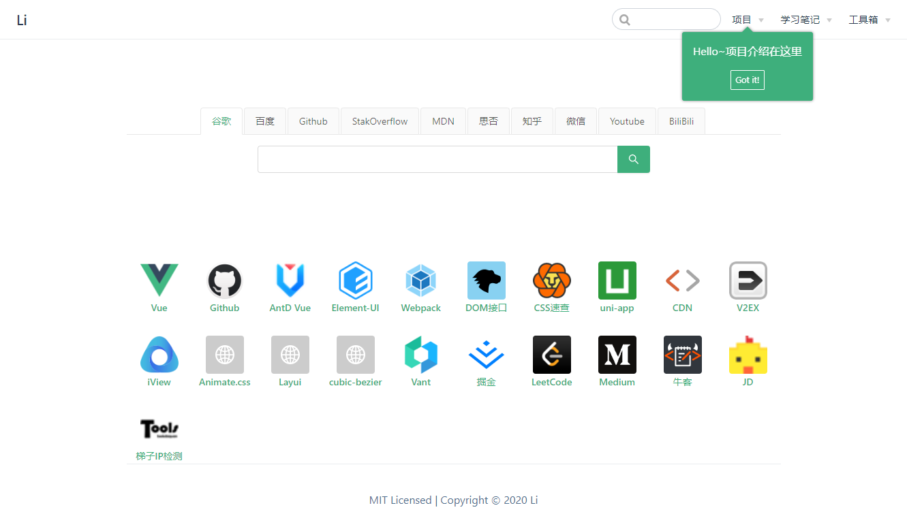
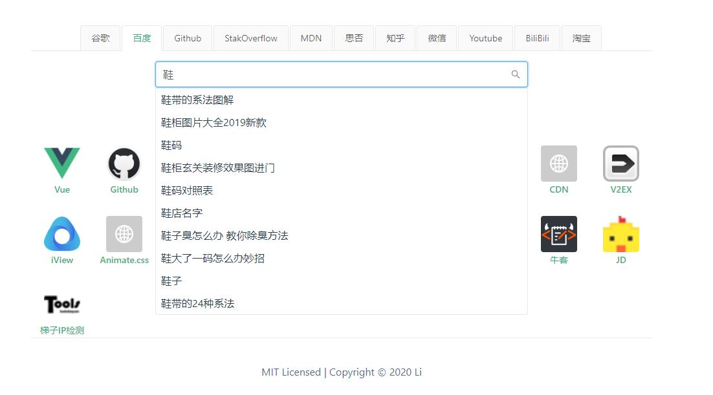
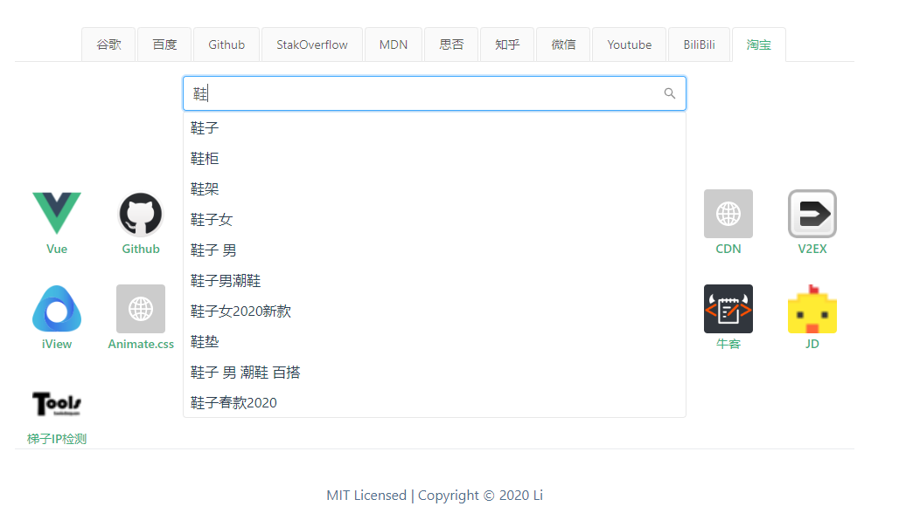
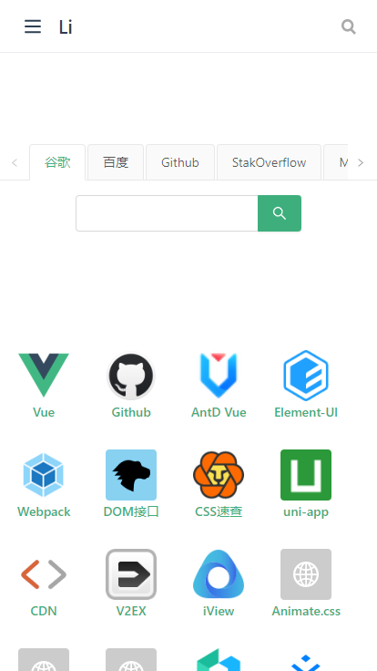
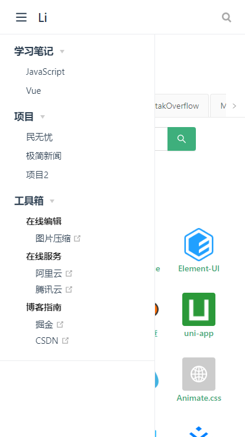

# 个人Blog
### 项目简介
基于Vuepress的自定义主题系统开发的个人导航页，可自定义搜索引擎和常用站点，根据搜索引擎不同搜索联想内容也不同

### 技术栈
+ Vue.js - 开发语言
+ Vuepress - 网站生成器
+ AntD - 前端UI框架
+ stylus - Css预编译器
+ git - 版本控制
+ GitHub Pages/Gitee Pages - 托管平台
+ vue-tour - 新手提示插件

### 项目截图
 
Web端
 

 
移动端
 

<Vssue  />

