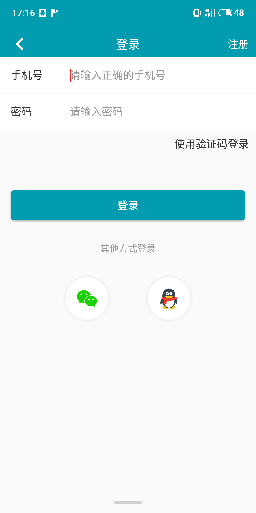
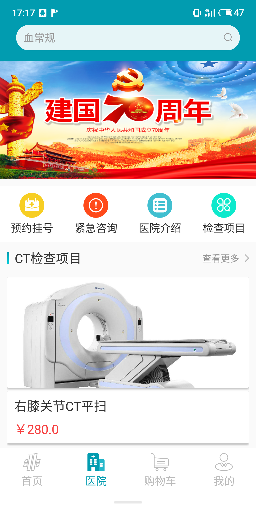
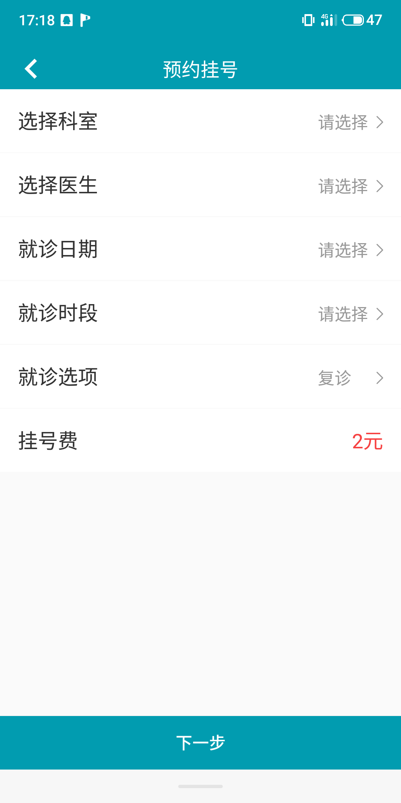
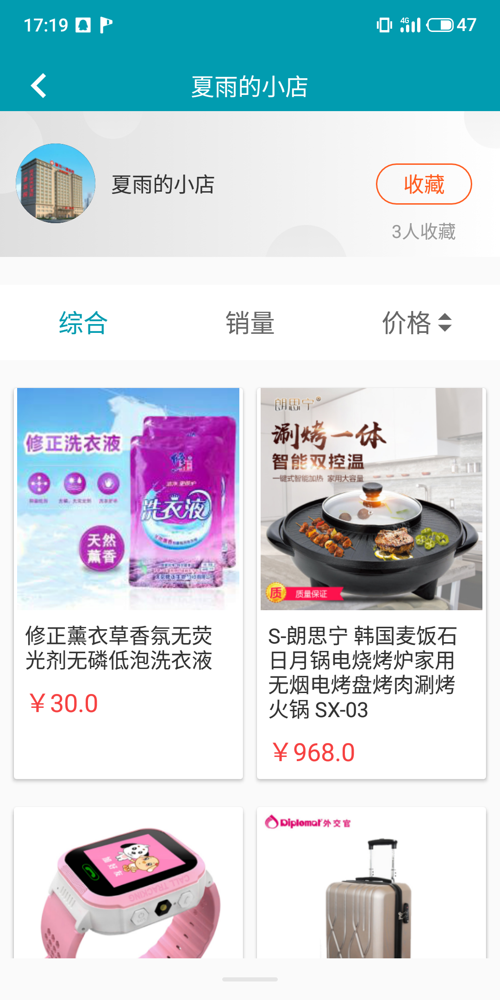
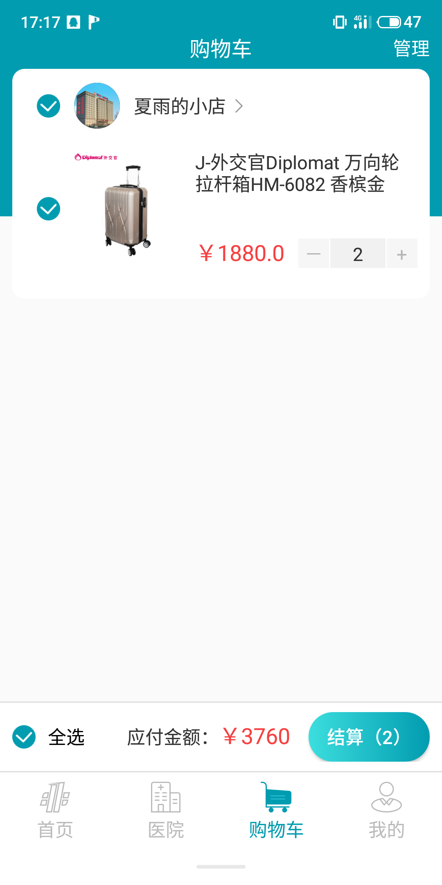
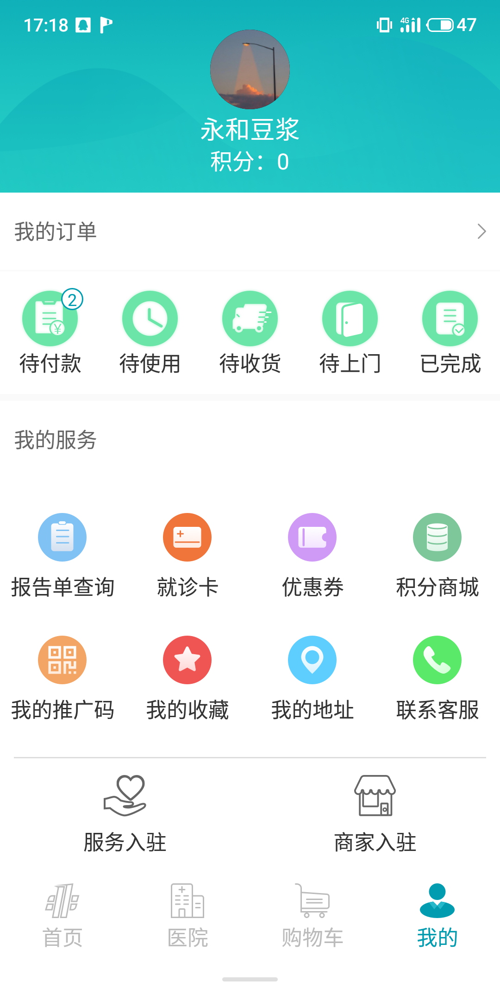
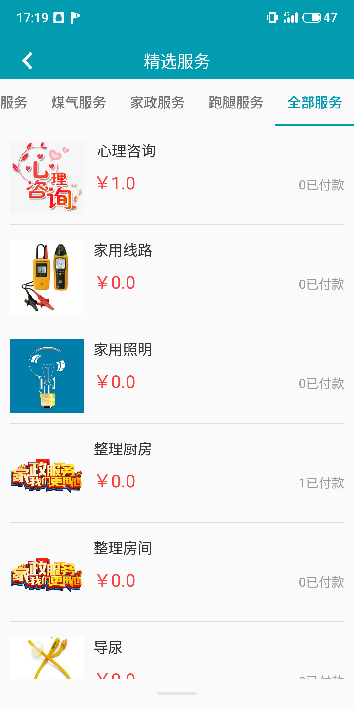

# 民无忧医疗生活服务APP
### 项目简介
民无忧App主要是为黑龙江省肇东市建一医院的病人服务的app。该app主要分类有三个大模块：
+ 医院模块：用户绑定建一医院的就诊卡，可以完成线上挂号，预约项目检查身体，比如：血常规，X光片等
+ 商城模块：用户可以在医院商城中选择商品购买，购买时可以选择自取或者快递
+ 服务模块：用户可以选择不同的服务项目，比如水电服务、家务服务、暖气服务等，填好服务信息，等待上门服务即可

### 技术栈
+ Vue.js - 开发语言
+ Vuex - Vue状态管理
+ uni-app - 跨平台应用的前端框架
+ Less/Sass - Css 预编译器
+ Webpack - 项目构建工具
+ git - 版本控制
+ ElementUI - 前端UI框架

### 项目截图
 

<Vssue  />