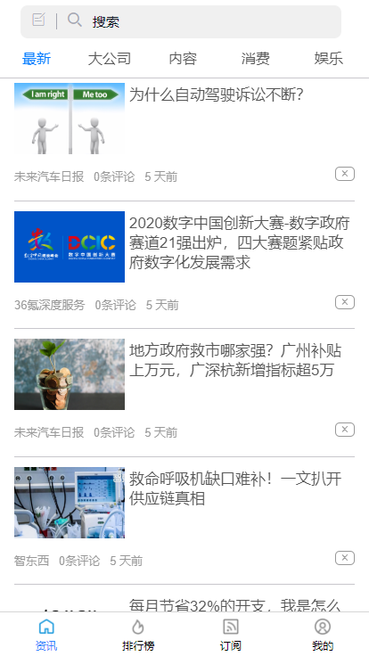
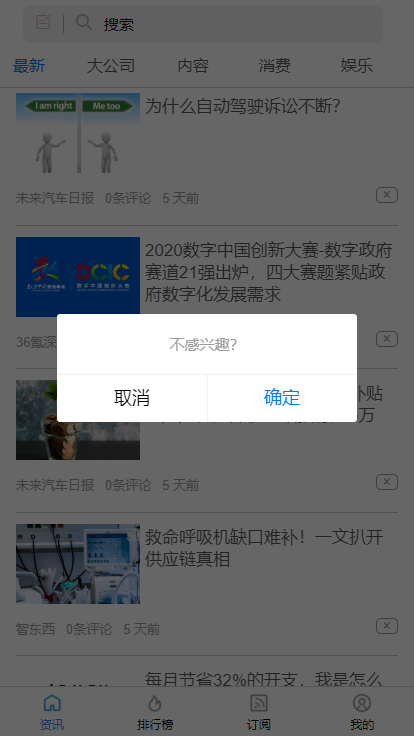
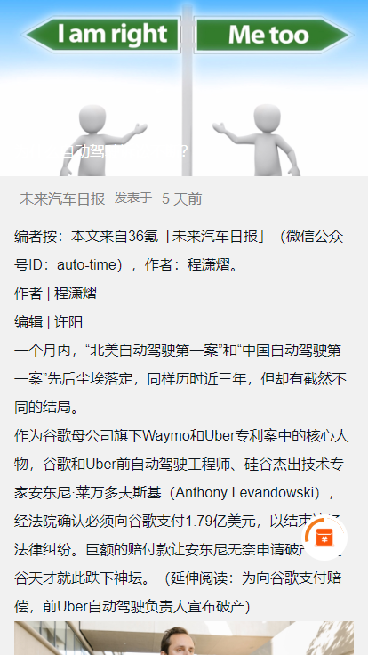
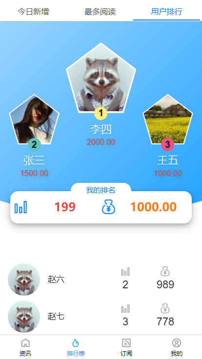

# 极简新闻（小程序+H5）
### 项目简介
极简新闻是一款极简风格的新闻阅读程序，可以同时在小程序和H5两端运行。用户在每篇新闻页面停留够一段时间即可点击领取一定积分，在排行榜页面可以看到用户积分排行。首页用户可以屏蔽自己不喜欢的新闻。

### 技术栈
+ Vue.js - 开发语言
+ Vuex - Vue状态管理
+ uni-app - 跨平台应用的前端框架
+ Less/Sass - Css 预编译器
+ Webpack - 项目构建工具
+ git - 版本控制
+ GraceUI- 前端UI框架

### 项目截图
 

<Vssue  />